# 第一章  点亮第一个LED

## 1.前期准备

安装好`STM32CubeMX`，用于生成`HAL`库代码，安装包至`ST`官网下载，有`windows`和`macOS`版本。本文使用版本号为`V6.12.0`,软件支持向下兼容模式，即高版本软件可以打开低版本软件创建的工程。

推荐两种开发环境，第一种为`Keil`，第二种为`vscode + platformio`。第一种为老牌开发环境，优点是软件安装方便，历经考验，稳定可靠。缺点是软件收费，且只有`windows`安装包，暂时不支持`macOS`。

第二种优点为编辑器功能更丰富，支持`windows`和`macOS`，且免费。缺点为安装设置略复杂。

本为分别介绍了`2`种开发环境的安装，您可按需选择。

## 2.创建项目

### 2.1.使用`STM32CubeMX`创建`HAL`工程代码

**步骤一： 启动`STM32CubeMX`，选择单片机型号**

首次使用可能需要登录`ST`账号下载相关组件，登录下载即可。本为以`RYMCU`星允派为开发板，因此选用`STM32F103VET6`单片机。

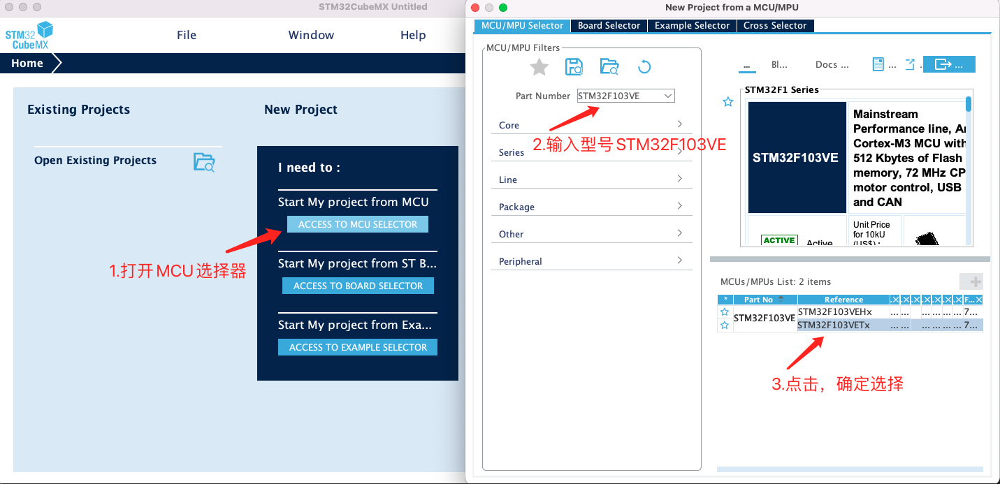

**步骤二：设置系统时钟，配置为外部晶振**

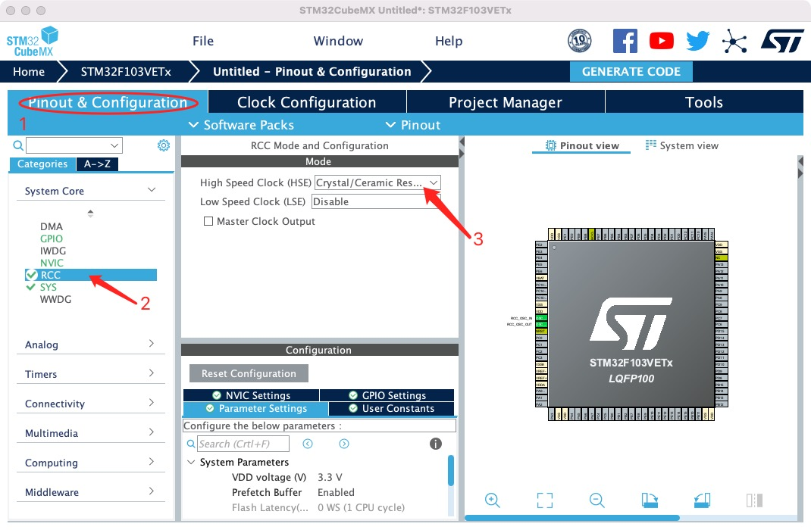

**步骤三：使能下载调试接口 `SWD`**

`SWD`接口用于代码下载及调试。

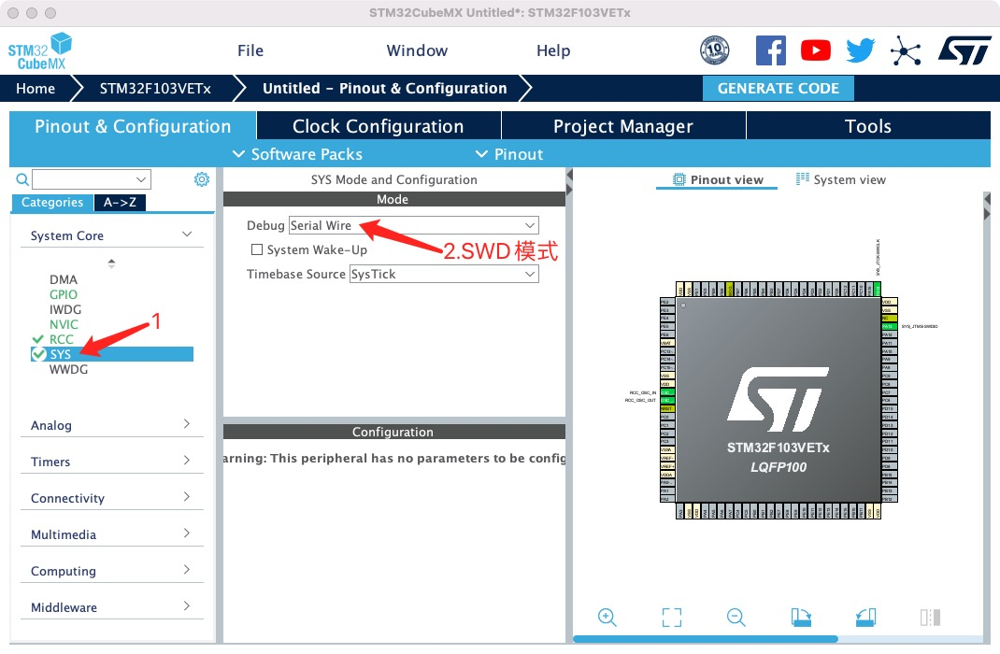

**步骤四：配置`LED1`,`LED2`**

星允派开发板配置了`8`个`LED`灯，对应`IO`口如下图所示。本文使用左下角`2`个`LED`灯为例子，分别对应单片机`IO`口`PB4`和`PB6`，为编程方便取名为`LED1`，`LED2`。

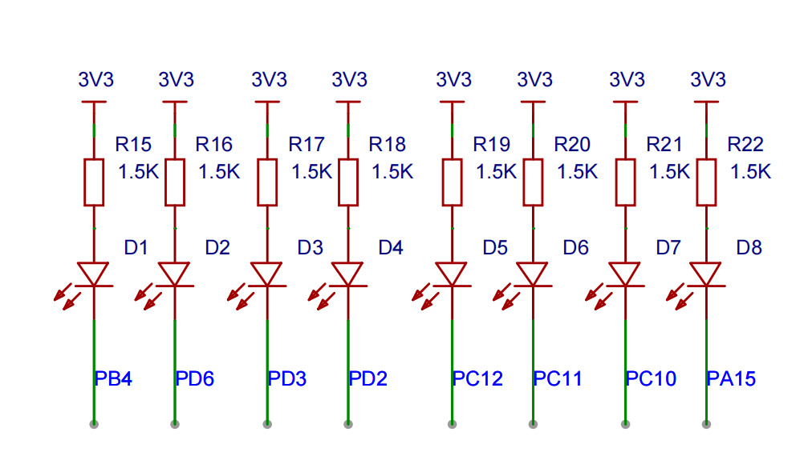

按下图将`PB4`配置为`LED1`，请使用同样方法可配置`PD6`为`LED2`,不再赘述。

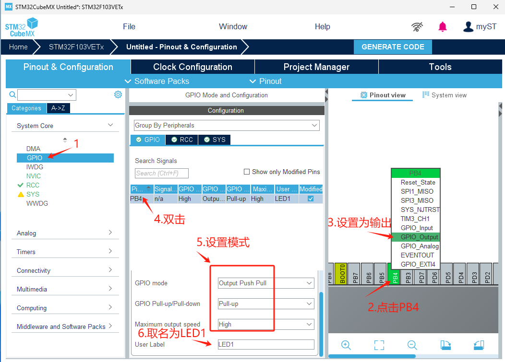

**步骤五：生成项目工程代码**

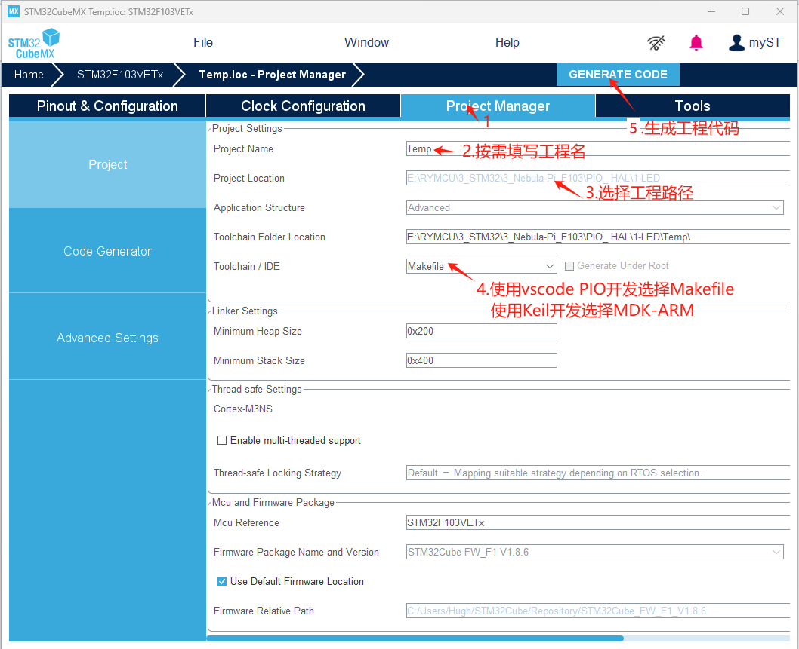

上图中，`2`、`3`分别为工程名字和存储地址，根据自己需要填写。

**`4`比较关键，使用`Keil`开发则选择`MDK-ARM`，如果使用`vscode + platformio`,选择`Makefile`。**

点击`5`生成工程代码。

### 2.2.创建`vscode + Platformio`工程

如果使用`Keil`开发，安装好之后，双击上述工程`MDK-ARM`文件夹下`.uvprojx`工程文件即可打开，编译，下载及第一次配置下载器操作如下。

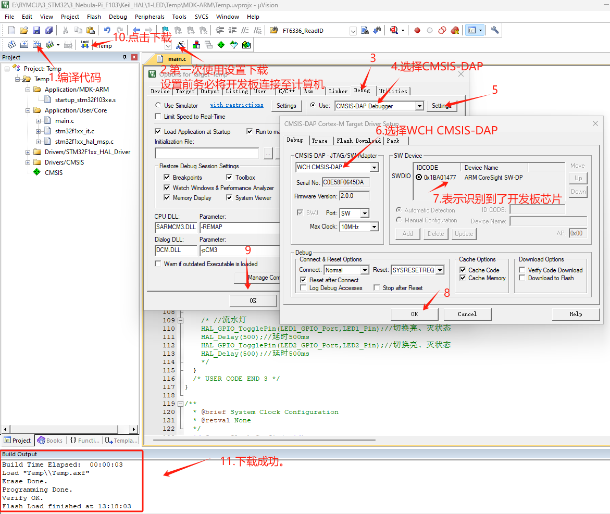

如果使用`vscode + Platformio`方式，首先安装`vscode`软件及`platformio`插件等相关内容，`vscode`请网络搜索并安装，完成后打开`vscode`，安装`platformio`插件及创建工程如下。

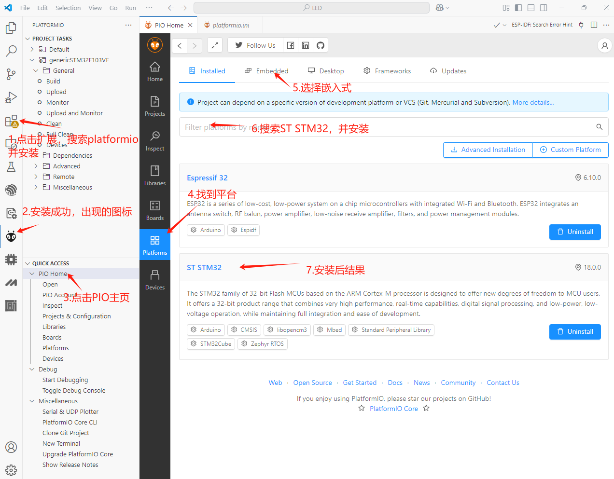

如上图所示，安装完成`platformio`插件后，还需安装嵌入式平台`ST STM32`，安装结果如上图`7`所示，本文`ST STM32`版本为`v18.0.0`。创建工程如下：

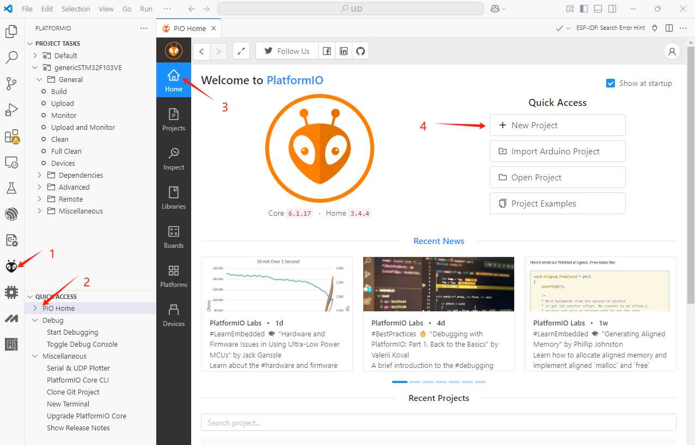

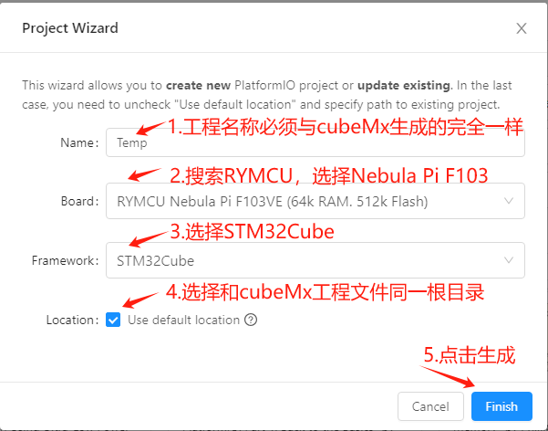

值得注意的是：

**为了确保能和`cubeMx`创建的工程相关联，创建时必须保证工程名一致。上图第`4`步取消勾选，选择和`cubeMx`创建工程文件为同一根目录。例如本文之前创建的工程在`Temp`文件夹下，这里只需要选到`Temp`文件夹根目录即可，不用继续点进去。**

创建完成之后，我们接下来配置一下，并尝试编译下载代码，下载时请确保开发板星云派已经连接至计算机。

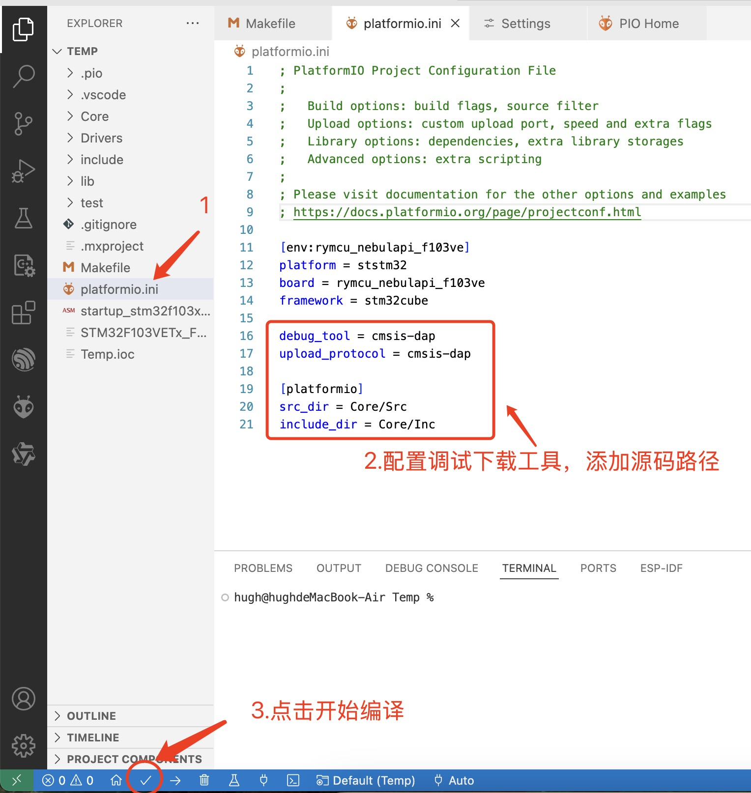
编辑`platformio.ini`文件，增加代码如下：
```
debug_tool = cmsis-dap
upload_protocol = cmsis-dap

[platformio]
src_dir = Core/Src
include_dir = Core/Inc
```
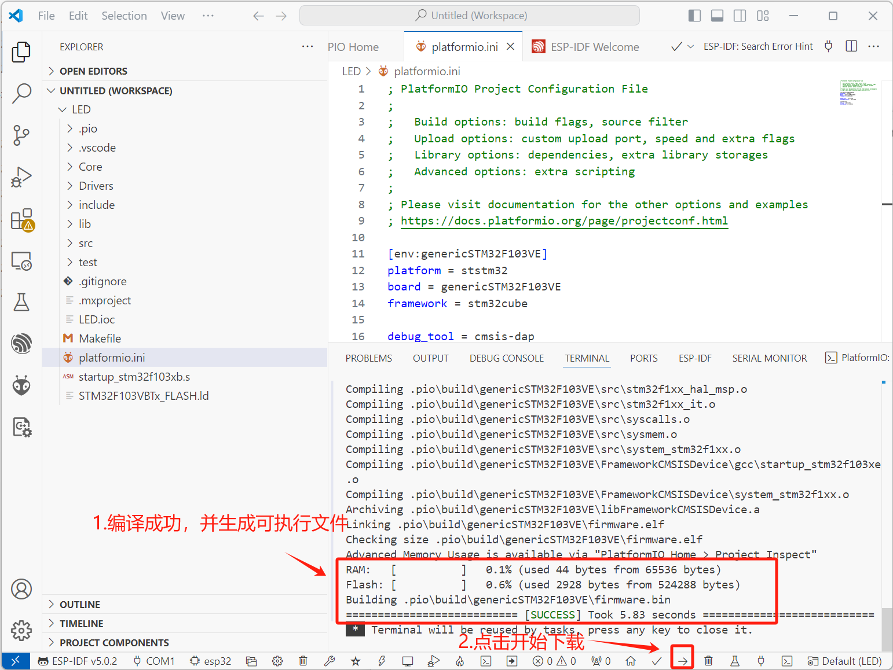

## 3.编辑代码

打开创建的工程，找到源文件夹`Src`的`main.c`，并在`while(1)` 循环中添加`2`条点亮`LED1`、`LED2`代码如下。`main()`函数中，其他代码均为系统生成的初始化代码，无需理会。

```c
int main(void)
{
  HAL_Init();
  /* Configure the system clock */
  SystemClock_Config();
  /* Initialize all configured peripherals */
  MX_GPIO_Init();
  while (1)
  {
      /* USER CODE BEGIN WHILE */
    //添加代码，点亮LED1，LED2
    HAL_GPIO_WritePin(LED1_GPIO_Port,LED1_Pin,GPIO_PIN_RESET);
    HAL_GPIO_WritePin(LED2_GPIO_Port,LED2_Pin,GPIO_PIN_RESET);
      /* USER CODE END WHILE */

  }
}
```

## 4.编译下载

按照`2.2`小结方法编译，将程序下载至开发板，观察`LED`灯是否点亮。

## 5.闪烁LED灯

更新`main`函数代码如下：

```c
int main(void)
{
    HAL_Init();
    /* Configure the system clock */
    SystemClock_Config();
    /* Initialize all configured peripherals */
    MX_GPIO_Init();
    while (1)
    {
        /* USER CODE BEGIN WHILE */
		//闪烁LED1
    	HAL_GPIO_TogglePin(LED1_GPIO_Port,LED1_Pin);//切换亮、灭状态
    	HAL_Delay(500);//延时500ms
        /* USER CODE END WHILE */
    }
}
```

如代码所示，在`while(1)`循环中，每隔`500ms`切换一次`LED1`亮或灭的状态，实现``LED1`闪烁功能。

## 6.流水灯

每隔`500ms`依次点亮`LED1`，`LED2`，实现流水灯效果，代码如下：

```c
int main(void)
{
    HAL_Init();
    /* Configure the system clock */
    SystemClock_Config();
    /* Initialize all configured peripherals */
    MX_GPIO_Init();
    while (1)
    {
        /* USER CODE BEGIN WHILE */
		//流水灯
    	HAL_GPIO_TogglePin(LED1_GPIO_Port,LED1_Pin);//切换亮、灭状态
    	HAL_Delay(500);//延时500ms
    	HAL_GPIO_TogglePin(LED2_GPIO_Port,LED2_Pin);//切换亮、灭状态
   		HAL_Delay(500);//延时500ms
        /* USER CODE END WHILE */
    }
}
```

将程序编译并下载至开发板,观察`LED`工作情况。

## 7.小节

本章内容相对繁琐，涉及到环境安装，好在只需要安装一次，后续专注编码即可，相对轻松很多。毕竟完事开头难嘛。
