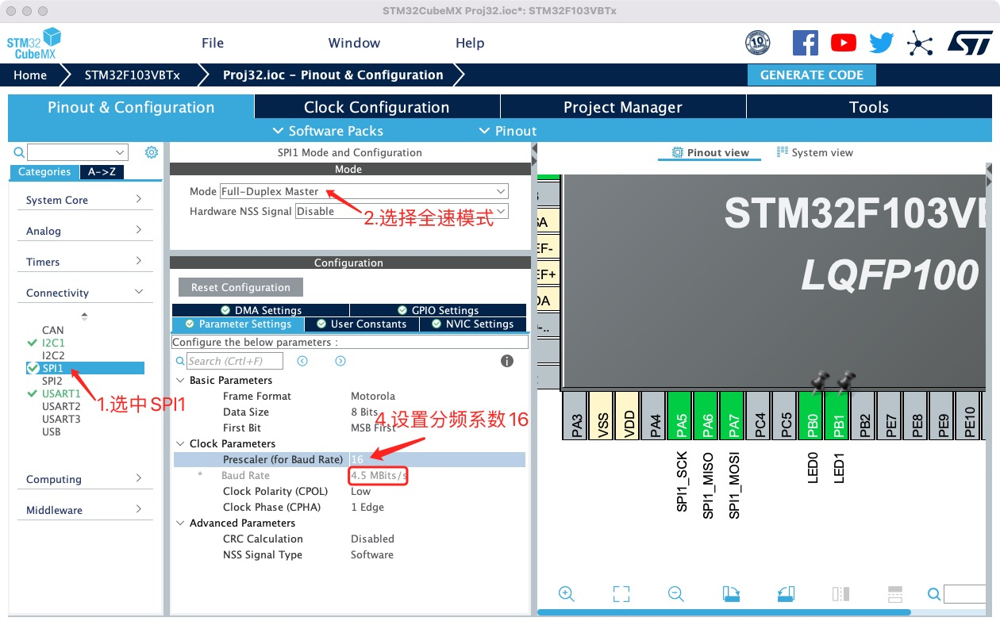
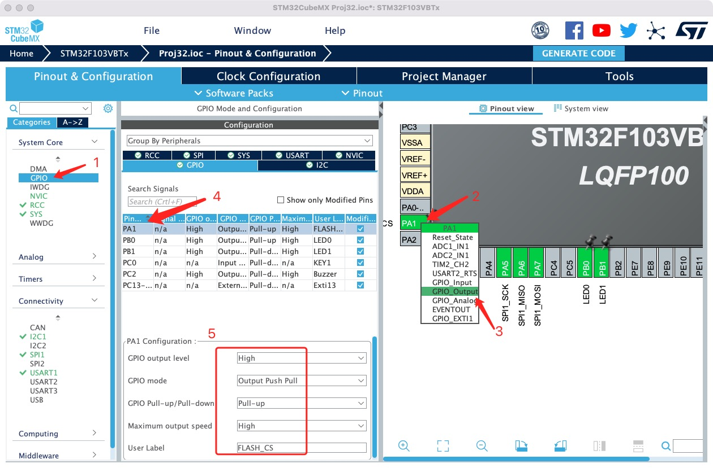
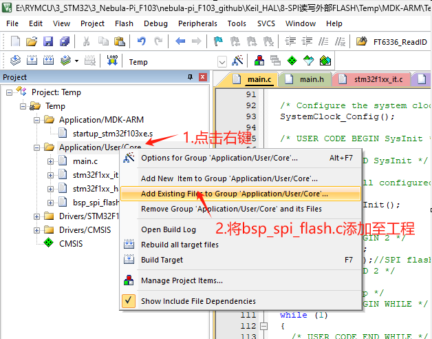
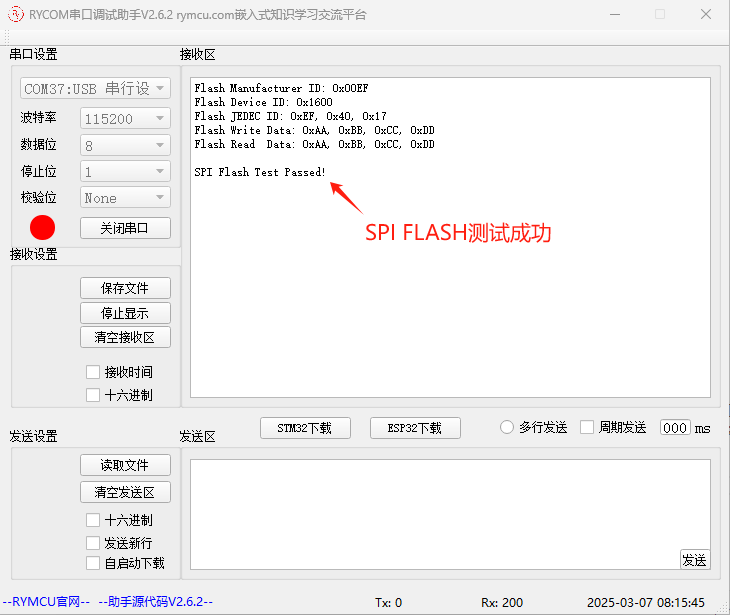

# 第八章 `SPI`读写外部`FLASH`

## 1.  前期准备

在第七章工程基础上实现以下功能：

通过`SPI`总线读写外部`FLASH`存储器`W25Q64`数据。

## 2.创建项目


星允派开发板上的`FLASH`存储设备`W25Q64`，共`8MB`存储空间，与单片机之间通过`SPI`协议通信，并且连接至单片机的`PA5`,`PA6`,`PA7`引脚，即对应单片机的`SPI1`外设，芯片片选连接至单片机`PA1`。

在第七章工程基础上，双击`Temp.ioc`，进入`STM32CubeMX`编辑页面，设置单片机的`SPI1`外设和`PA1`引脚。



开启 `SPI1`，因开发板外部 `Flash W25Q64`和单片机之间通过 `SPI1`实现通信。`SPI1`模式选择 `Full-Duplex-Master`，`4`处分频系数改为 `16`将波特率设置为 `4.5Mbit/s`。



配置`FLASH`片选引脚`PA1`为上拉输出，如上图所示。

## 3.编辑代码

`main.c`文件中自动生成了`SPI`对象以及初始化代码：

```c
 //spi1对象
 SPI_HandleTypeDef hspi1;
 //根据配置自动生成初始化代码，并在main函数中进行了调用
static void MX_SPI1_Init(void)
{
  hspi1.Instance = SPI1;
  hspi1.Init.Mode = SPI_MODE_MASTER;
  hspi1.Init.Direction = SPI_DIRECTION_2LINES;
  hspi1.Init.DataSize = SPI_DATASIZE_8BIT;
  hspi1.Init.CLKPolarity = SPI_POLARITY_LOW;
  hspi1.Init.CLKPhase = SPI_PHASE_1EDGE;
  hspi1.Init.NSS = SPI_NSS_SOFT;
  hspi1.Init.BaudRatePrescaler = SPI_BAUDRATEPRESCALER_16;
  hspi1.Init.FirstBit = SPI_FIRSTBIT_MSB;
  hspi1.Init.TIMode = SPI_TIMODE_DISABLE;
  hspi1.Init.CRCCalculation = SPI_CRCCALCULATION_DISABLE;
  hspi1.Init.CRCPolynomial = 10;
  if (HAL_SPI_Init(&hspi1) != HAL_OK)
  {
    Error_Handler();
  }
}
```

在`main`函数中将调用`MX_SPI1_Init()`完成`SPI`初始化，同时在项目中自动添加了`stm32f1xx_hal_spi.h`,`stm32f1xx_hal_spi.c`文件，其中`1`个关键函数用来实现读写`W25Q64`：

```c
HAL_StatusTypeDef HAL_SPI_TransmitReceive(SPI_HandleTypeDef *hspi, uint8_t *pTxData, uint8_t *pRxData, uint16_t Size,uint32_t Timeout);
```

参数定义如下：

* `hspi` ：`SPI`对象指针 
* `pTxData`：写数据的`buff`指针
* `pRxData`：读出数据存储指针
* `Size` ：读或写数据大小 
* `Timeout` ：操作超时时间

`SPI`底层通信已经准备完毕，单片机对`W25Q64`的读、写操作均在上面函数的基础上完成。

## 4.添加`W25Q64`驱动

项目添加驱动文件`bsp_spi_flash.h`，`bsp_spi_flash.c`，分别放置`Core/Inc`和`Core/Src`,如果使用`Keil`开发，还需要在工程再次添加`.c`文件，如下图所示。



修改`main.c`代码如下：

```c
//添加头文件支持
#include "string.h"
#include "bsp_spi_flash.h"//SPI flash驱动
/* USER CODE BEGIN PV */
SPI_HandleTypeDef *hspi_flash = &hspi1; // 必须定义
/* USER CODE END PV */
```

驱动文件中关键函数如下所示：

```c
/* 函数声明 */
void Flash_Init(void);
void Flash_WriteEnable(void);
void Flash_WriteDisable(void);
uint8_t Flash_ReadStatusReg(void);
HAL_StatusTypeDef Flash_WaitBusy(void);
HAL_StatusTypeDef Flash_ReadData(uint32_t addr, uint8_t *pData, uint16_t Size);
HAL_StatusTypeDef Flash_PageProgram(uint32_t addr, uint8_t *pData, uint16_t Size);
HAL_StatusTypeDef Flash_SectorErase(uint32_t addr);
void Flash_ReadID(uint16_t *ManufacturerID, uint16_t *DeviceID);
void Flash_ReadJedecID(uint8_t *id);
```

包含`ID`读取、`FLASH`的擦除、读、写等操作，在`main`函数中调用上述函数实现对`W25Q64`的读写。

## 5.读写`W25Q64`示例

`mian.c`文件中添加测试函数：

```c
void spi_flash_test(void)
{
  /* 测试Flash驱动 */
  uint16_t manu_id, dev_id;
  uint8_t jedec_id[3];
  uint8_t write_buf[256] = {0xAA, 0xBB, 0xCC, 0xDD};
  uint8_t read_buf[256];
  
  Flash_ReadID(&manu_id, &dev_id);
  printf("Flash Manufacturer ID: 0x%04X\r\n", manu_id);
  printf("Flash Device ID: 0x%04X\r\n", dev_id);
  Flash_ReadJedecID(jedec_id);
  printf("Flash JEDEC ID: 0x%02X, 0x%02X, 0x%02X\r\n", jedec_id[0], jedec_id[1], jedec_id[2]);
  
  if (Flash_SectorErase(0x0000) == HAL_OK) {
    Flash_PageProgram(0x0000, write_buf, 4);
    Flash_ReadData(0x0000, read_buf, 4);
  }
  printf("Flash Write Data: 0x%02X, 0x%02X, 0x%02X, 0x%02X\r\n", write_buf[0], write_buf[1], write_buf[2], write_buf[3]);
  printf("Flash Read  Data: 0x%02X, 0x%02X, 0x%02X, 0x%02X\r\n", read_buf[0], read_buf[1], read_buf[2], read_buf[3]);
  // 验证数据
  if (memcmp(write_buf, read_buf, 4) == 0) {
    printf("\r\nSPI Flash Test Passed!\r\n");
  }
}
```

测试函数功能为：读取`WQ2564`器件`ID`，写数据，并将数据读出打印显示。在`main`函数中调用`spi_flash_test()`。

## 6.编译下载

将程序编译下载至开发板，并将开发板连接至`PC`,打开串口调试助手`RYCOM`，并设置为：`115200+8+N+1`，接收结果如下。



## 7.小结

本章学习了通过`SPI`总线读写`FLASH`器件`W25Q64`，掌握了基本的读写操作。