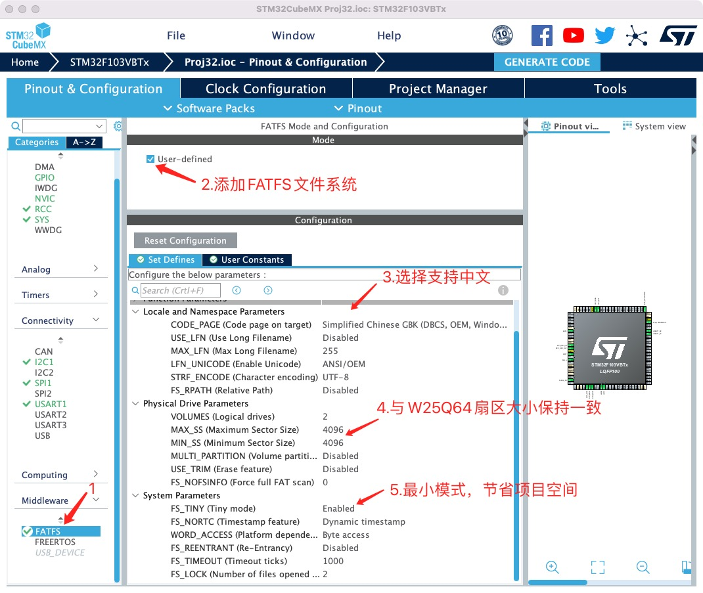
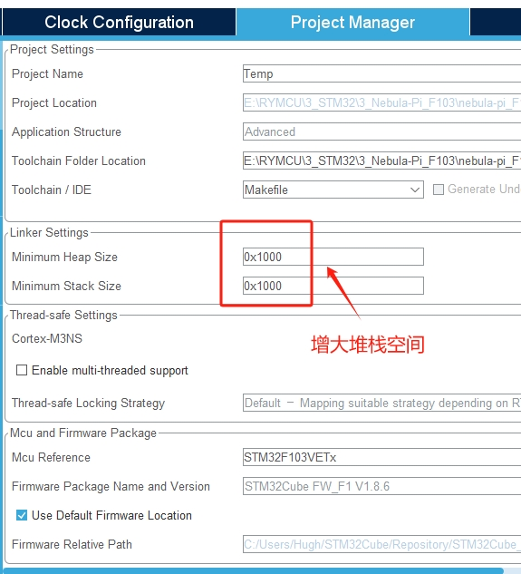
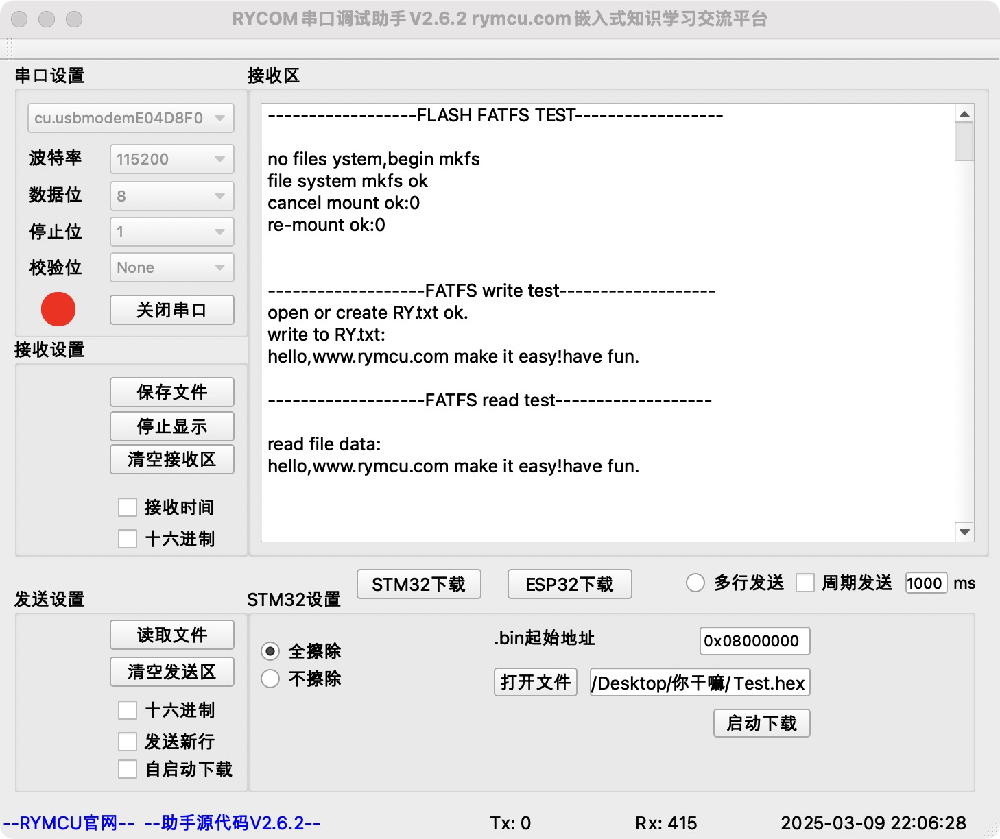

# 第九章 `FATFS`文件系统

## 1.  前期准备

上一章已经掌握了如何读写`FLASH`，如果一直采用直接操作`FLASH`的方法会非常的繁琐，需要自行记住哪些地方用了，哪些没用以及哪些地方具体放了哪些内容，显然不适合管理。这章我们引进文件管理系统`FATFS`，由她来直接操作`FLASH`，我们只需要调用她提供的方法实现文件管理即可，解放生产力。

## 2.创建项目

**在第八章基础上新增配置如下：**



适当增加堆栈空间。



重新生成代码，项目将自动添加`FATFS`相关代码。

## 3.编辑代码

重新生成代码之后，给`FATFS`添加`FLASH`驱动，让她可以直接操作`FLASH`。我们只需更改`user_diskio.c`文件中相关函数，实现对`FLASH`的初始化、擦除、读、写等操作。包括：`USER_ioctl()`、`USER_initialize()`、`USER_status()`、`USER_read()`、`USER_write()`,下面逐一介绍：

**步骤一：添加`FLASH`头文件**

```c
//user_diskio.c文件中添加
#include "bsp_spi_flash.h"//添加FLASH驱动
```

**步骤二： `USER_ioctl()`修改**

`FATFS`调用该函数获取`FLASH`的器件信息，函数中添加扇区大小、扇区数量信息等，代码如下：

```c
DRESULT USER_ioctl (
    BYTE pdrv,      /* Physical drive nmuber (0..) */
    BYTE cmd,       /* Control code */
    void *buff      /* Buffer to send/receive control data */
)
{
  /* USER CODE BEGIN IOCTL */
    DRESULT res = RES_ERROR;
    //获取FLASH参数
    if(pdrv==0) {
        switch (cmd) {
            case CTRL_SYNC:
                res = RES_OK;
                break;
            case GET_SECTOR_SIZE:
                *(DWORD *) buff = 4096;//W25Q64每扇区为4096Byte
                res = RES_OK;
                break;
            case GET_SECTOR_COUNT:
                *(DWORD *) buff = 2048;//W25Q64容量为8MB，共计2048个扇区
                res = RES_OK;
                break;
            case GET_BLOCK_SIZE:
                *(DWORD *) buff = 1;//单次读写操作擦除扇区个数
                res = RES_OK;
                break;
            default:
                res = RES_PARERR;
        }
    }
    else
    {
        res = RES_PARERR;
    }
    return res;
  /* USER CODE END IOCTL */
}
```

**步骤三 `USER_initialize()`修改**

`FATFS`调用该函数实现`FLASH`的初始化，我们在`main.c`中已经完成了，只需要返回`OK`即可，代码如下：

```c
/**
  * @brief  Initializes a Drive
  * @param  pdrv: Physical drive number (0..)
  * @retval DSTATUS: Operation status
  */
DSTATUS USER_initialize (
    BYTE pdrv           /* Physical drive nmuber to identify the drive */
)
{
  /* USER CODE BEGIN INIT */
    Stat = STA_NOINIT;
    //添加代码
    switch (pdrv)
    {
        case 1://SD
            Stat = RES_PARERR;
            break;
        case 0://Flash，工程中使用驱动器0
            //main函数中自动生成了W25Q64的初始化代码，直接返回成功。
            Stat = RES_OK;
            break;
        default:
            Stat = RES_PARERR;
    }
    return Stat;
  /* USER CODE END INIT */
}
```

**步骤四： `USER_status()`修改**

`FATFS`调用该函数获取`FLASH`状态，已经准备好了，同样返回`OK`即可，代码如下：

```c
/**
  * @brief  Gets Disk Status
  * @param  pdrv: Physical drive number (0..)
  * @retval DSTATUS: Operation status
  */
DSTATUS USER_status (
    BYTE pdrv       /* Physical drive number to identify the drive */
)
{
  /* USER CODE BEGIN STATUS */
    Stat = STA_NOINIT;
    //返回启动器的状态，工程中使用了驱动器0
    if(pdrv==0) Stat = RES_OK;//main函数中自动生成了FLASH初始化代码，直接返回成功。
    return Stat;
  /* USER CODE END STATUS */
}
```

**步骤五：`USER_read()`修改**

`FATFS`调用该函数读取`FLASH`数据，添加读取函数即可，代码如下：

```c
/**
  * @brief  Reads Sector(s)
  * @param  pdrv: Physical drive number (0..)
  * @param  *buff: Data buffer to store read data
  * @param  sector: Sector address (LBA)
  * @param  count: Number of sectors to read (1..128)
  * @retval DRESULT: Operation result
  */
DRESULT USER_read (
    BYTE pdrv,      /* Physical drive nmuber to identify the drive */
    BYTE *buff,     /* Data buffer to store read data */
    DWORD sector,   /* Sector address in LBA */
    UINT count      /* Number of sectors to read */
)
{
  /* USER CODE BEGIN READ */
  //添加FLASH读函数
  if(pdrv==0)
  {
      //调用读数据函数，值得注意的是sector指的是0-2047，即哪一个扇区，与W25Q64实际扇区地址不是一个概念
      //一个扇区对应4096个字节，因此，输入地址为sector*4096，count同理。
      Flash_ReadData(sector * 4096, (uint8_t *)buff, count * 4096);
      return RES_OK;
  }
  else
  {
      return RES_PARERR;
  }
  /* USER CODE END READ */
}
```

**步骤六： `USER_write()`修改**

`FATFS`调用该函数实现对`FLASH`写操作，添加写函数即可，代码如下：

```c
/**
  * @brief  Writes Sector(s)
  * @param  pdrv: Physical drive number (0..)
  * @param  *buff: Data to be written
  * @param  sector: Sector address (LBA)
  * @param  count: Number of sectors to write (1..128)
  * @retval DRESULT: Operation result
  */
#if _USE_WRITE == 1
DRESULT USER_write (
    BYTE pdrv,          /* Physical drive nmuber to identify the drive */
    const BYTE *buff,   /* Data to be written */
    DWORD sector,       /* Sector address in LBA */
    UINT count          /* Number of sectors to write */
)
{
  /* USER CODE BEGIN WRITE */
  if(pdrv==0)
  {
      //添加写函数
      //FLASH写操作前需要进行扇区擦除，需要擦除count个扇区，在USER_ioctl函数中
      //设置了GET_BLOCK_SIZE为1,即单次读写操作擦除扇区个数为1，所以count值
      //始终为1，因此只需要调用一次扇区擦除即可。
      Flash_SectorErase(sector * 4096);
    	FLASH_WriteData(sector * 4096, (uint8_t *)buff, count * 4096);
      /* USER CODE HERE */
      return RES_OK;
  }
  else
  {
      return RES_PARERR;
  }
  /* USER CODE END WRITE */
}
#endif /* _USE_WRITE == 1 */
```

**步骤七： 准备就绪**

至此，已经完成了`FATFS`所有驱动的修改，添加上层代码便可实现文件管理了。

**步骤八： 若使用`vscode + platformIO`开发**

重新配置`platformio.ini`如下：

```c
; PlatformIO Project Configuration File
;
;   Build options: build flags, source filter
;   Upload options: custom upload port, speed and extra flags
;   Library options: dependencies, extra library storages
;   Advanced options: extra scripting
;
; Please visit documentation for the other options and examples
; https://docs.platformio.org/page/projectconf.html

[env:rymcu_nebulapi_f103ve]
platform = ststm32
board = rymcu_nebulapi_f103ve

upload_protocol = cmsis-dap
build_unflags = 
build_flags =
 -DUSE_HAL_DRIVER
 -DSTM32F103xE

 -ICore/Inc 
 -IDrivers/STM32F1xx_HAL_Driver/Inc 
 -IDrivers/STM32F1xx_HAL_Driver/Inc/Legacy 
 -IDrivers/CMSIS/Device/ST/STM32F1xx/Include 
 -IDrivers/CMSIS/Include 
 -IFATFS/Target 
 -IFATFS/App 
 -IMiddlewares/Third_Party/FatFs/src

build_src_filter = +<Core/Src> +<Drivers/> +<Middlewares/> +<FATFS/> +<startup_stm32f103xe.s>
board_build.ldscript = ./STM32F103VETx_FLASH.ld

[platformio]
src_dir = ./
```

## 4.`FATFS`文件系统示例

在`main.c`中添加代码实现文件的创建、写入、读取功能！实现功能为：在`FLASH`上创建`RY.txt`文件，并写入、读出数据。`mian.c`文件中添加代码如下：

```c
// FATFS测试
void FATFS_FLASH_Test(void)
{
  static FATFS fs; // 文件系统对象
  static FIL fnew; // 文件对象
  BYTE FATFS_Wr_Buff[128] = "hello, www.rymcu.com make it easy!have fun.\r\n"; // 写缓冲区
  BYTE FATFS_Rd_Buff[128] = {0};// 读缓冲区
  UINT fnum;// 成功读写数量
  FRESULT res;// 返回

  printf("\r\n\r\n------------------FLASH FATFS TEST------------------\r\n\r\n");
  res = f_mount(&fs, "0:", 1);
  if (res == FR_NO_FILESYSTEM)
  {
    printf("no file system,begin mkfs\r\n");
    res = f_mkfs("0:", 0, 0); //格式化
    if (res == FR_OK)
    {
      printf("file system mkfs ok\r\n");
      // 格式化成功后先取消，再重新挂载！
      res = f_mount(NULL, "0:", 1);
      printf("cancel mount ok:%d\r\n", res);
      res = f_mount(&fs, "0:", 1);
      printf("re-mount ok:%d\r\n", res);
    }
    else
    {
      printf("failed mount\r\n");
    }
  }
  else
  {
    printf("file system alreadly existed.\r\n");
  }
  printf("\r\n\r\n-------------------FATFS write test-------------------\r\n");
  // 打开文件，文件不存在则创建并打开
  res = f_open(&fnew, "RY.txt", FA_CREATE_ALWAYS | FA_WRITE);
  if (res == FR_OK)
    printf("open or create RY.txt ok.\r\n");
  else
    printf("open or create file failed\r\n");
  // 写测试
  res = f_write(&fnew, FATFS_Wr_Buff, sizeof(FATFS_Wr_Buff), &fnum);
  if (res == FR_OK)
    printf("write to RY.txt:\r\n%s", FATFS_Wr_Buff);
  else
    printf("failed to write RY.txt,code: %d!\r\n", res);
  // 完成写操作后，关闭文件
  f_close(&fnew);
  printf("\r\n-------------------FATFS read test-------------------\r\n\r\n");
  // 打开文件，读方式打开已创建的文件
  res = f_open(&fnew, "RY.txt", FA_OPEN_EXISTING | FA_READ);
  if (res != FR_OK)
  {
    printf("open RY.txt failed\r\n");
    return;
  }
  // 读取文件测试
  res = f_read(&fnew, FATFS_Rd_Buff, sizeof(FATFS_Rd_Buff), &fnum);
  if (res != FR_OK)
  {
    printf("read file failed\r\n");
    return;
  }
  printf("read file data:\r\n%s\r\n", FATFS_Rd_Buff);
  f_close(&fnew); // 读取完毕，关闭文件
}
```

## 5.编译下载

将程序编译下载至开发板，并将开发板连接至`PC`,打开串口调试助手`RYCOM`，并设置为：`115200+8+N+1`，接收结果如下。



## 6.小结

本章学习了通过`FATFS`系统，实现了简单的文件操作。
