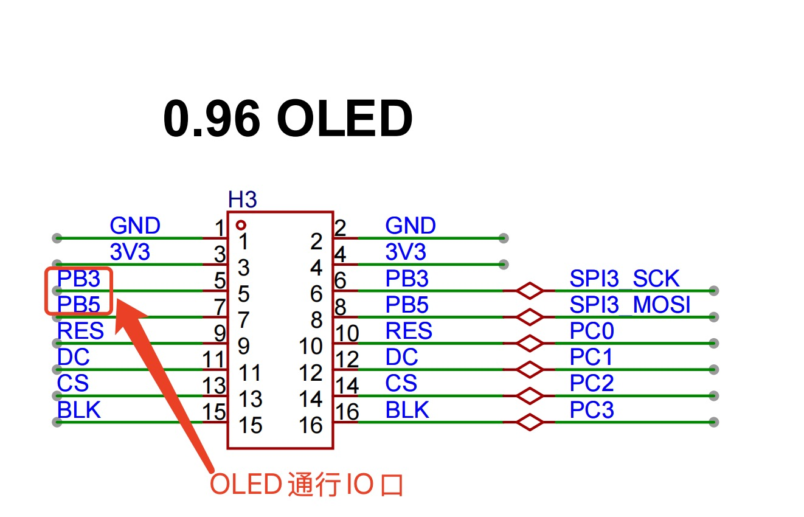
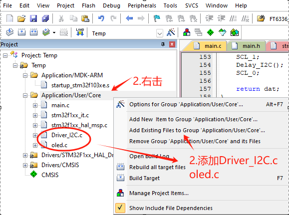
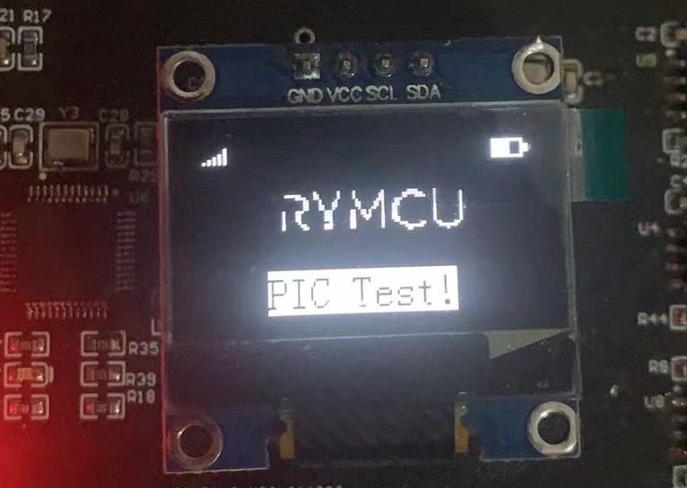

# 第十三章 `OLED`液晶显示器

## 1.  前期准备

在第十二章基础上实现，`0.96`寸`OLED`显示功能。

`0.96 OLED`介绍以及基础代码详见[《跟着Hugh学开发--51单片机篇》](https://github.com/rymcu/30-days-of-nebula-pi/blob/main/docs/20-OLED使用.md)，在上述基础代码之上适配`STM32`。

## 2.创建项目

将`bmp.h`、`oled.h`、`oledfont.h`、`oled.c`、`Driver_I2C.h`、`Driver_I2C.c`添加至工程现有项目中，为了兼顾`SPI`通信的液晶显示器，星允派使用`PB3`，`PB5`模拟`I2C`通信，实现`OLED`的读写工程。原理图`IO`口安排如下。



**步骤一： 配置`IO`口如下**

`PB3`,`PB5`分别命名为`OLED_SCL`,`OLED_SDA`,设置为输出模式。


## 3.OLED显示示例

在`main.c`中添加头文件及代码测试代码：

```c
#include "oled.h"
#include "bmp.h"
#include "math.h"
//0.96 OLED测试
void OLED_IIC_Test(void)
{
    OLED_Init();//初始化OLED
    OLED_Clear();//清除屏幕
    OLED_Display_On();//开启OLED

/*****************************************
    *
    *0.96 OLED 字符显示测试
    *
*******************************************/
    OLED_ShowChar( 0,0,'A',16,0);
    OLED_ShowChar( 8,0,'B',16,0);
    OLED_ShowChar(16,0,'C',16,0);
    OLED_ShowChar(24,0,'D',16,0);

    OLED_ShowChar( 0,2,'A',8,0);
    OLED_ShowChar( 8,2,'B',8,0);
    OLED_ShowChar(16,2,'C',8,0);
    OLED_ShowChar(24,2,'D',8,0);

    OLED_ShowString(25,6,"Char Test!",16,1);

    HAL_Delay(5000);
    OLED_Clear();//清除屏幕

/*****************************************
    *
    *0.96 OLED 数字显示测试
    *
*******************************************/

    OLED_ShowNum(  0,1,12,2,16,0);
    OLED_ShowNum( 48,1,34,2,16,0);
    OLED_ShowNum( 96,1,56,2,16,0);

    OLED_ShowString(25,6,"Num Test!",16,1);

    HAL_Delay(5000);
    OLED_Clear();//清除屏幕

/*****************************************
    *
    *0.96 OLED 中文显示测试
    *
*******************************************/
    OLED_ShowCHinese(22   ,3,1,0);//不
    OLED_ShowCHinese(22+16,3,2,0);//见
    OLED_ShowCHinese(22+32,3,3,0);//不
    OLED_ShowCHinese(22+48,3,4,0);//散
    OLED_ShowCHinese(22+64,3,5,0);//！

    OLED_ShowString(25,6,"CHN Test!",16,1);

    HAL_Delay(5000);
    OLED_Clear();//清除屏幕

/*****************************************
    *
    *0.96 OLED 字符串显示测试
    *
*******************************************/

    OLED_ShowString(0,2,"Nebula-Pi,RYMCU!",16,0);
    OLED_ShowString(25,6,"Str Test!",16,1);
    HAL_Delay(5000);
    OLED_Clear();//清除屏幕
/*****************************************
    *
    *0.96 OLED 图片显示测试
    *
*******************************************/

    OLED_DrawBMP(0,0,Logo,0);//显示图片
    OLED_ShowString(25,6,"PIC Test!",16,1);
    HAL_Delay(5000);
}
```

`keil`工程需要再次添加`.c`文件到项目工程：



## 4.编译下载

将程序编译下载至开发板，观察OLED显示效果，最后图片显示效果如下：

## 5.小结

本章学习了通过模拟`IIC`协议控制`0.96 OLED`。
