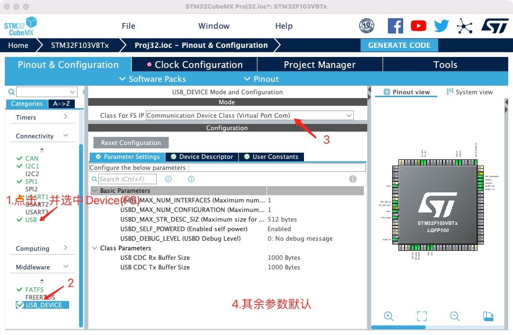
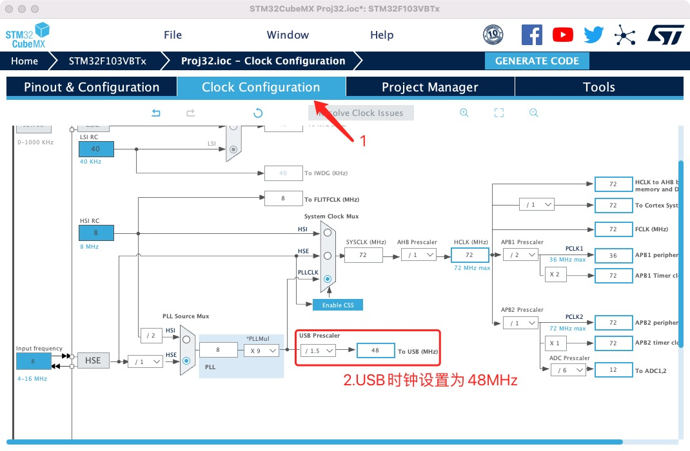
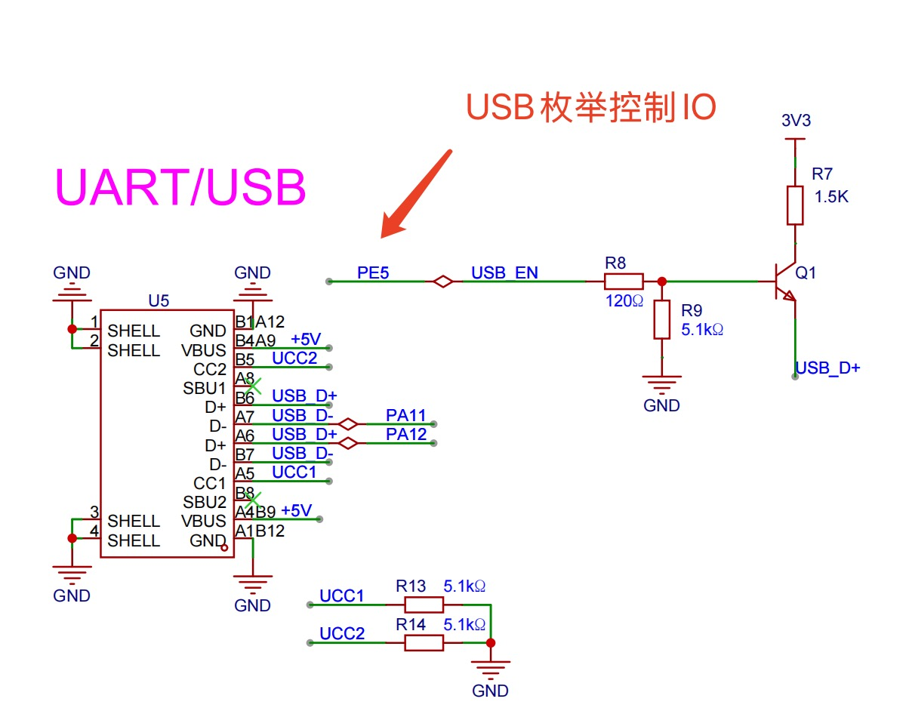
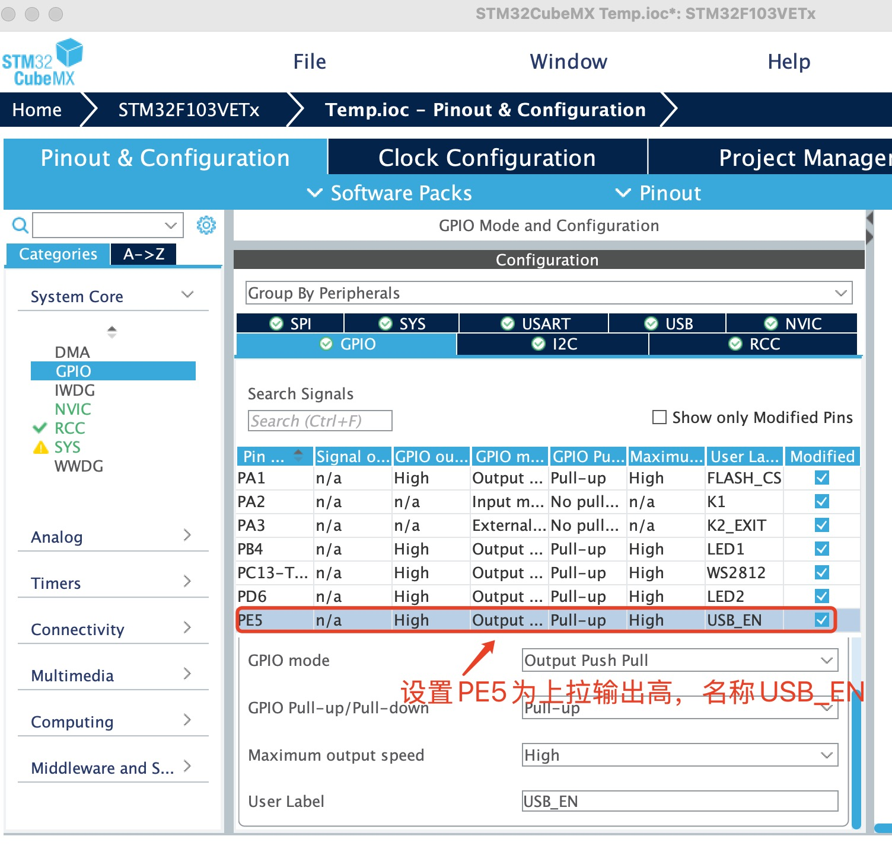
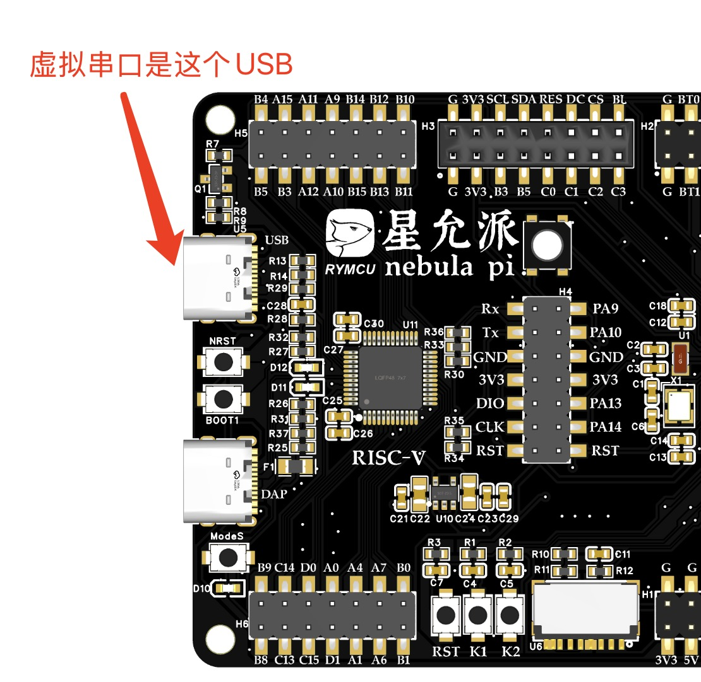
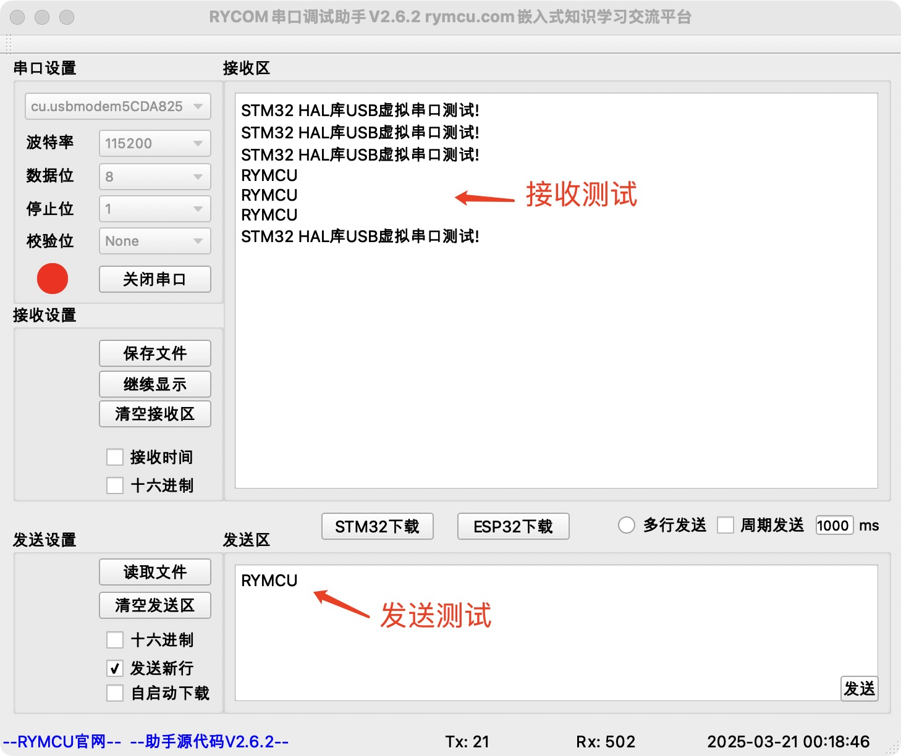

# 第十四章 `USB`虚拟串口

## 1.  前期准备

利用`STM32`单片机的`USB`虚拟成串口，并和串口调试小助手通信实现数据收发功能，在第九章《`FATFS`文件系统》基础上创建工程。

## 2.创建项目

`USB`虚拟串口配置如下：



`USB`时钟配置为`48MHz`。



星允派使用PE5作为USB的枚举控制引脚，当PE5为高电平时，将USB+通过1.5K上拉，使得计算机能够正确识别。



因此在cubeMx设置如下：



**生成项目前，`Heap Size`，`Stack Size`设置大一点，我这里均设置为`0x1000`。`STM32F103`的`CAN`和`USB`是共用`IO`口的，因此，需要确保没有使用`CAN`功能，这点很关键。**

## 3.编辑代码

**步骤一：虚拟串口发送测试**

项目自动创建了USB初始化代码，main.c中添加头文件及虚拟串口发送测试代码：

```c
#include "usbd_cdc_if.h"
//main函数添加如下代码
  unsigned char USB_CDC_buff[] = {"STM32 HAL库USB虚拟串口测试!\r\n"};
  while (1)
  {

      CDC_Transmit_FS(USB_CDC_buff, sizeof(USB_CDC_buff));
      HAL_Delay(2000);
 }
```

**步骤二：虚拟串口接收测试**

在虚拟串口接收函数中，将接收到数据通过虚拟串口原样发送出去：

```c
//函数位于usbd_cdc_if.c文件中
static int8_t CDC_Receive_FS(uint8_t* Buf, uint32_t *Len)
{
  /* USER CODE BEGIN 6 */
//接收到的数据发送回去，此行代码手动添加，其余均自动生成！
  CDC_Transmit_FS(Buf,Len[0]);

  USBD_CDC_SetRxBuffer(&hUsbDeviceFS, &Buf[0]);
  USBD_CDC_ReceivePacket(&hUsbDeviceFS);
  return (USBD_OK);
  /* USER CODE END 6 */
}
```

**步骤三：配置`platformio.ini`**

使用`vscode` + `platformIO`开发配置文件如下，`Keil`开发请忽略。

```ini
; PlatformIO Project Configuration File
;
;   Build options: build flags, source filter
;   Upload options: custom upload port, speed and extra flags
;   Library options: dependencies, extra library storages
;   Advanced options: extra scripting
;
; Please visit documentation for the other options and examples
; https://docs.platformio.org/page/projectconf.html

[env:rymcu_nebulapi_f103ve]
platform = ststm32
board = rymcu_nebulapi_f103ve

upload_protocol = cmsis-dap
build_unflags = 
build_flags =
 -DUSE_HAL_DRIVER
 -DSTM32F103xE

 -ICore/Inc 
 -IDrivers/STM32F1xx_HAL_Driver/Inc 
 -IDrivers/STM32F1xx_HAL_Driver/Inc/Legacy 
 -IDrivers/CMSIS/Device/ST/STM32F1xx/Include 
 -IDrivers/CMSIS/Include 
 -IFATFS/Target 
 -IFATFS/App 
 -IMiddlewares/Third_Party/FatFs/src
 -IUSB_DEVICE/App 
 -IUSB_DEVICE/Target 
 -IMiddlewares/ST/STM32_USB_Device_Library/Core/Inc 
 -IMiddlewares/ST/STM32_USB_Device_Library/Class/CDC/Inc 
 

build_src_filter = +<Core/Src> +<Drivers/> +<Middlewares/> +<FATFS/> +<startup_stm32f103xe.s> +<USB_DEVICE/>
board_build.ldscript = ./STM32F103VETx_FLASH.ld

[platformio]
src_dir = ./
```


## 4.编译下载

将程序编译下载至开发板，并将开发板左上角`usb`连接至`PC`,注意不是左下角的下载USB。



打开串口调试助手`RYCOM`，并设置为：`115200+8+N+1`，接收结果如下。



## 5.小结

本章学习了`HAL`库`USB`虚拟串口发送、接收试验。