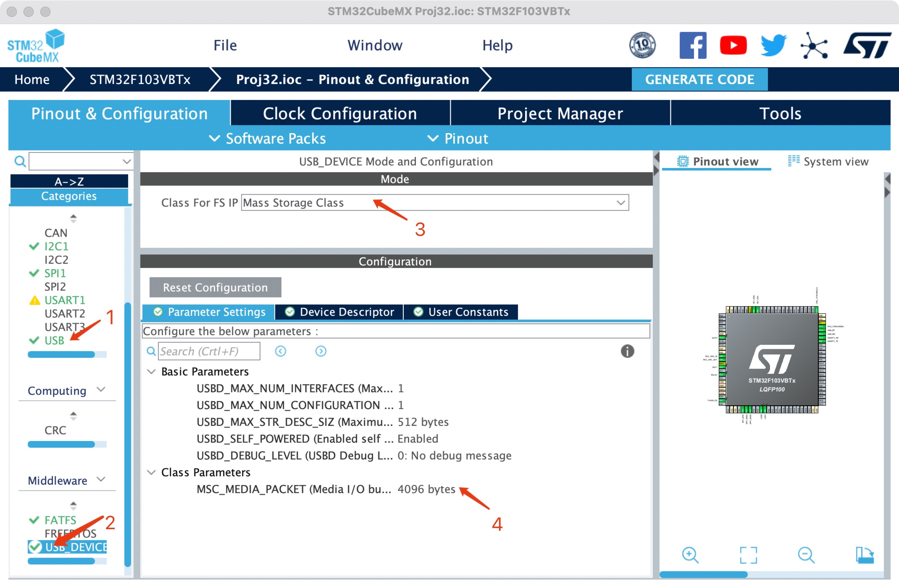
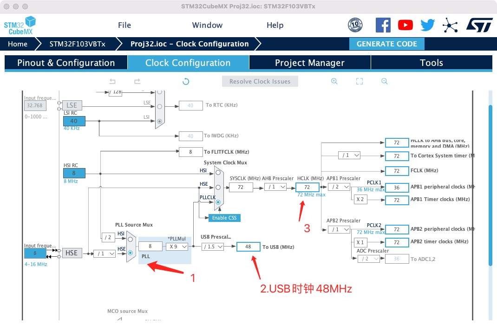
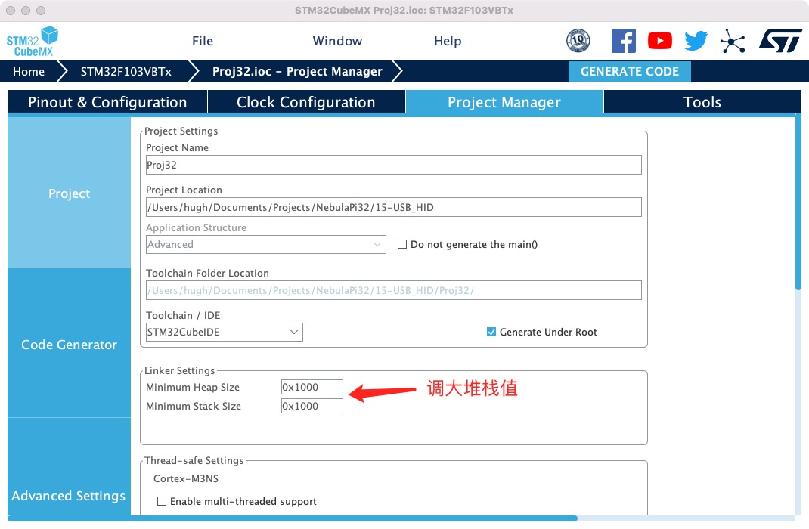
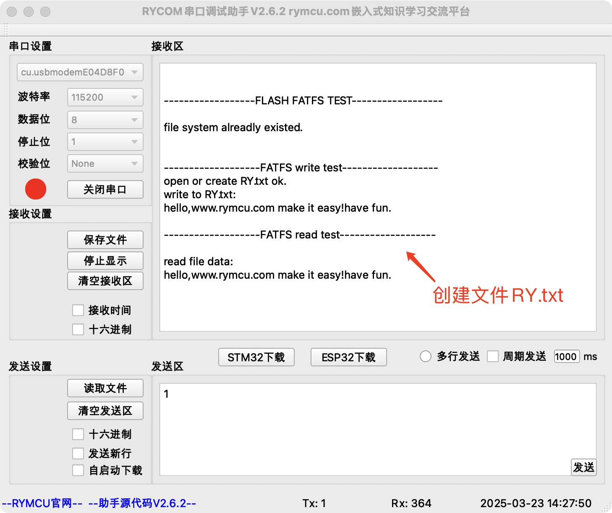
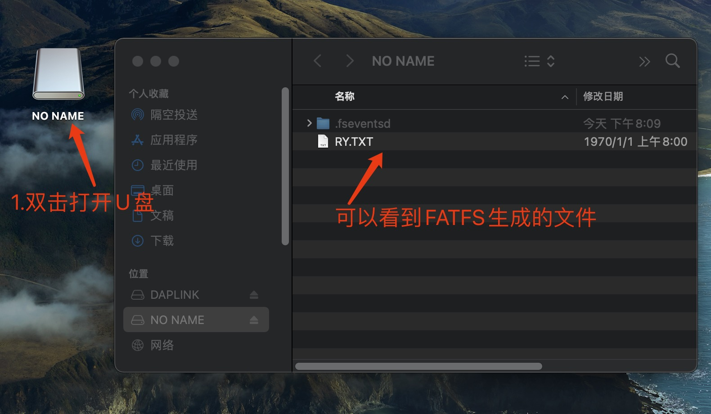

# 第十六章 `FLASH`模拟`U`盘

## 1.  前期准备

在第十五章《`USB`模拟键盘》基础上创建工程。实现功能：

使用`SPI FLASH`模拟`U`盘，并在电脑上打开该`U`盘可以看见通过`FATFS`创建的文件。

## 2.创建项目

**步骤一： 配置`USB MSC`设备**



点击`1`处，选中后`Device(FS)`，`3`处选择`MSC`大容量存储设备,`4`处改为`4096`与`FLASH`扇区大小保持一致，其他参数默认。

**步骤二：配置USB 时钟**



`USB`时钟需设置为`48MHz`。

**步骤三：增加堆栈大小，防止溢出**



## 3.编辑代码

**步骤一：更改`USB`驱动**

找到`usbd_storage_if.c`文件，添加头文件，并添加全局变量：

```c
#include "bsp_spi_flash.h"

#define STORAGE_LUN_NBR                  1
#define STORAGE_BLK_NBR                  256*8 //256*8扇区=8MByte
#define STORAGE_BLK_SIZ                  4096  //每个扇区4096Byte
#define START_SECTOR                     0     //开始扇区
```

**步骤二： 修改`USB`容量获取函数`STORAGE_GetCapacity_FS`**

```c
int8_t STORAGE_GetCapacity_FS(uint8_t lun, uint32_t *block_num, uint16_t *block_size)
{
    /* USER CODE BEGIN 3 */
    *block_num  = STORAGE_BLK_NBR;
    *block_size = STORAGE_BLK_SIZ;
    return (USBD_OK);
    /* USER CODE END 3 */
}
```

**步骤三： 修改`USB`读函数**

```c
int8_t STORAGE_Read_FS(uint8_t lun, uint8_t *buf, uint32_t blk_addr, uint16_t blk_len)
{
    /* USER CODE BEGIN 6 */
    blk_addr+=START_SECTOR;
    Flash_ReadData(blk_addr*STORAGE_BLK_SIZ,buf,blk_len*STORAGE_BLK_SIZ);

    return (USBD_OK);
    /* USER CODE END 6 */
}
```

**步骤四： 修改`USB`写函数**

```c
int8_t STORAGE_Write_FS(uint8_t lun, uint8_t *buf, uint32_t blk_addr, uint16_t blk_len)
{
    /* USER CODE BEGIN 7 */
    uint32_t write_addr;
    blk_addr+=START_SECTOR;
    write_addr = blk_addr*STORAGE_BLK_SIZ;
  Flash_SectorErase(write_addr);
  FLASH_WriteData(write_addr,(uint8_t *)buf,blk_len * STORAGE_BLK_SIZ);

    return (USBD_OK);
    /* USER CODE END 7 */
}
```

**步骤五：配置`platformio.ini`**

使用`vscode` + `platformIO`开发配置文件如下，`Keil`开发请忽略。

```ini
; PlatformIO Project Configuration File
;
;   Build options: build flags, source filter
;   Upload options: custom upload port, speed and extra flags
;   Library options: dependencies, extra library storages
;   Advanced options: extra scripting
;
; Please visit documentation for the other options and examples
; https://docs.platformio.org/page/projectconf.html

[env:rymcu_nebulapi_f103ve]
platform = ststm32
board = rymcu_nebulapi_f103ve

upload_protocol = cmsis-dap
build_unflags = 
build_flags =
 -DUSE_HAL_DRIVER
 -DSTM32F103xE

 -ICore/Inc 
 -IDrivers/STM32F1xx_HAL_Driver/Inc 
 -IDrivers/STM32F1xx_HAL_Driver/Inc/Legacy 
 -IDrivers/CMSIS/Device/ST/STM32F1xx/Include 
 -IDrivers/CMSIS/Include 
 -IFATFS/Target 
 -IFATFS/App 
 -IMiddlewares/Third_Party/FatFs/src
 -IUSB_DEVICE/App 
 -IUSB_DEVICE/Target 
 -IMiddlewares/ST/STM32_USB_Device_Library/Core/Inc 
 -IMiddlewares/ST/STM32_USB_Device_Library/Class/MSC/Inc 
 

build_src_filter = +<Core/Src> +<Drivers/> +<Middlewares/> +<FATFS/> +<startup_stm32f103xe.s> +<USB_DEVICE/>
board_build.ldscript = ./STM32F103VETx_FLASH.ld

[platformio]
src_dir = ./
```

## 4.U盘测试

`main.c`中保留原来`FATFS`文件系统测试函数：

```c
  FATFS_FLASH_Test();
```

**步骤一：运行代码， `FATFS`成功创建`RY.txt`文件，串口输出如下。**



**步骤二： `USB`插入`PC`，查看`U`盘内容，可看到`FATFS`文件系统创建的`RY.txt`**

## 

## 5.小结

本章实现了使用`SPI FLASH`模拟`U`盘，并在`U`盘上创建了文件。