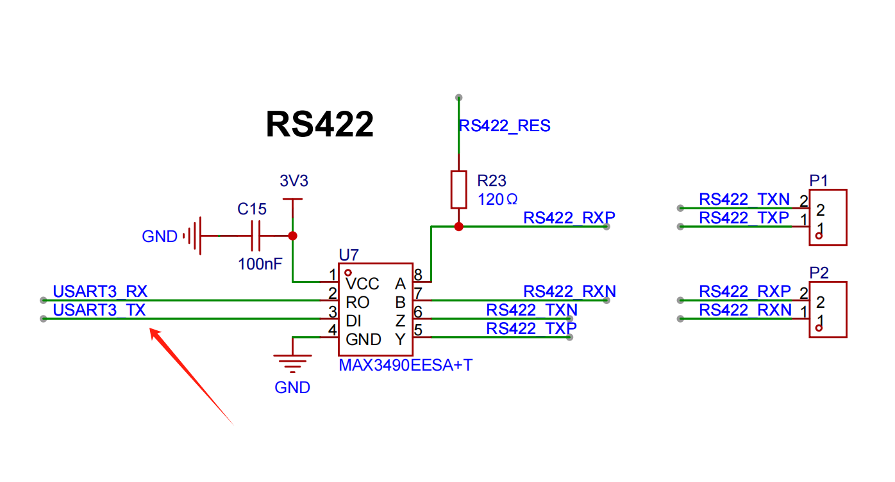
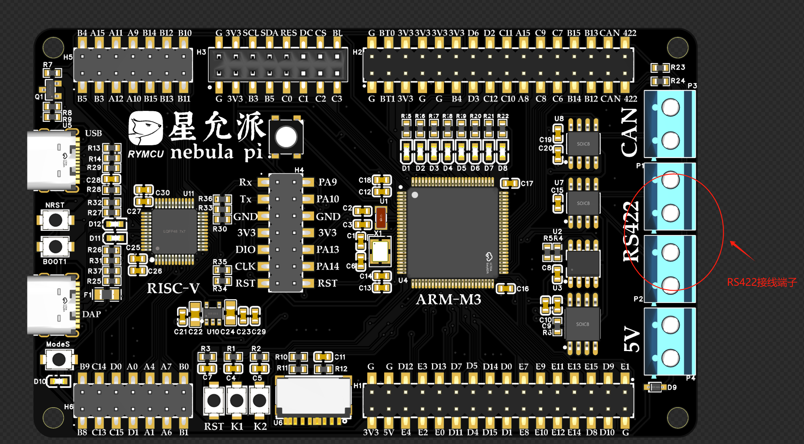
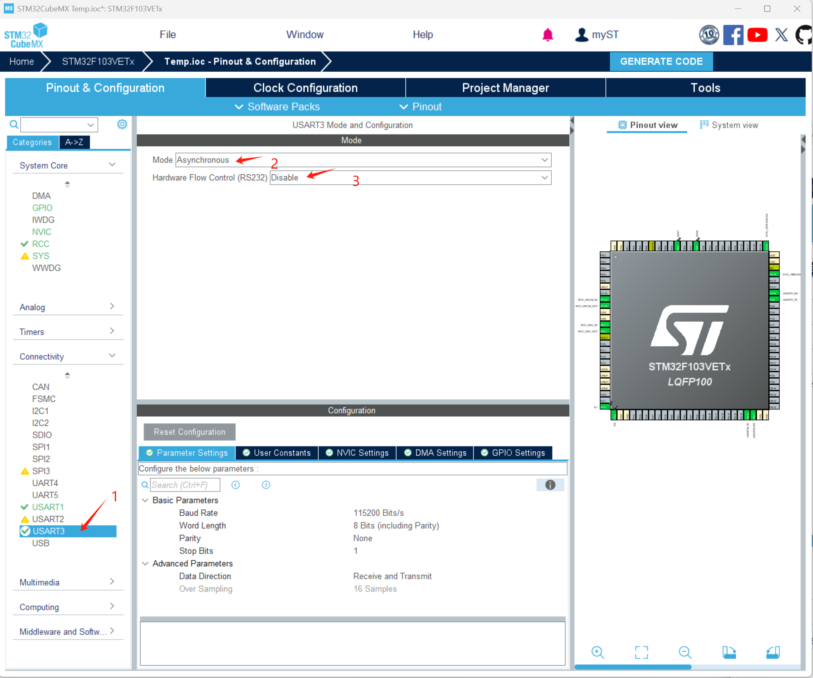
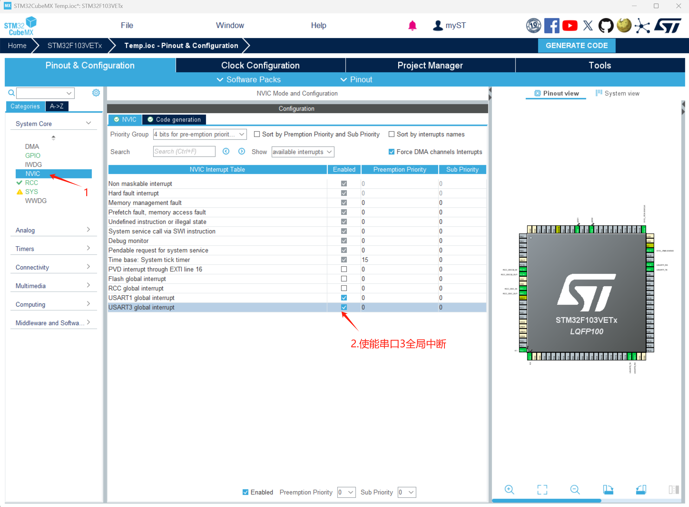
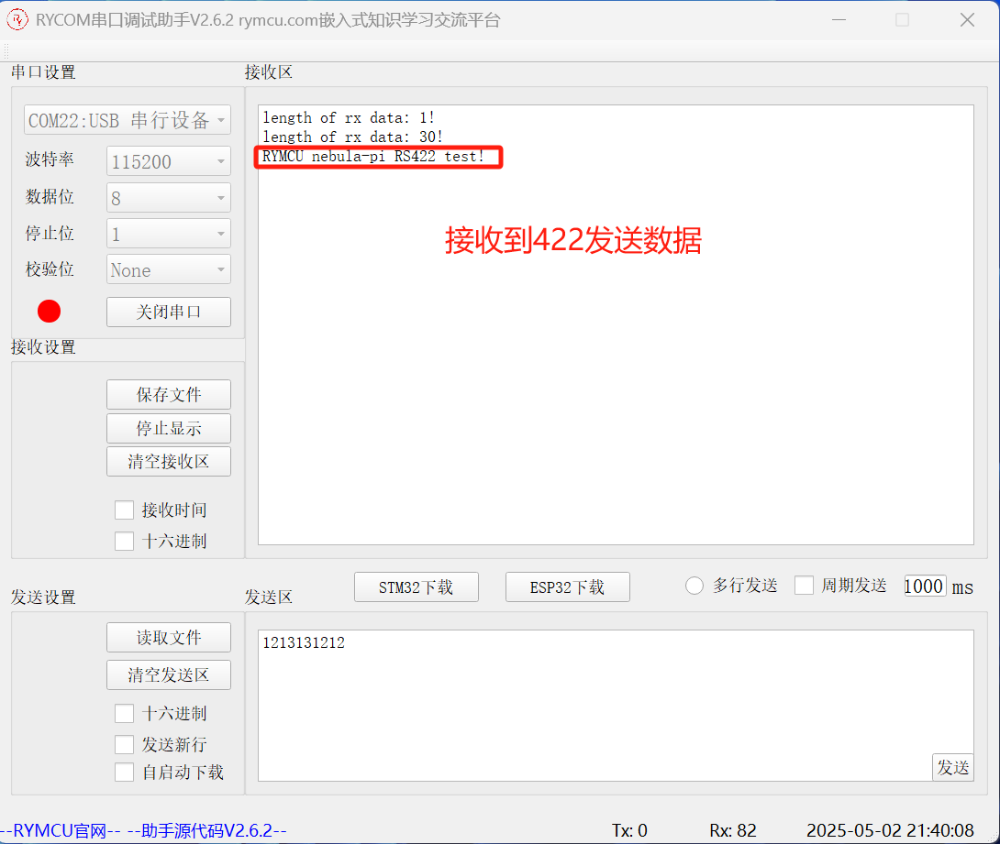

# 第十八章 `RS422`串口通信

## 1.前期准备

在第四章工程基础上实现以下功能：

实现`RS422`串口通信。

## 2.创建项目

星允派将`STM32`芯片串口`3`（`USART3`）连接至`RS422`接口电平转换芯片，因此，只需要实现串口3的收发功能便可实现`RS422`通信了。






双击`Temp.ioc`，进入`STM32CubeMX`编辑页面，添加串口`USART3`设置。





## 3.编辑代码

**步骤一：使能串口接收、空闲中断**

在`main.c`的`static void MX_USART3_UART_Init(void)`函数最后添加代码如下：

```c
  /* USER CODE BEGIN USART3_Init 2 */
  __HAL_UART_ENABLE_IT(&huart3,UART_IT_IDLE|UART_IT_RXNE);//开启接收中断，空闲中断
  /* USER CODE END USART3_Init 2 */
```

**步骤二：修改串口中断处理函数**

`stm32f1xx_it.c`文件中找到串口中断函数`void USART3_IRQHandler(void)`，并注释系统处理函数`HAL_UART_IRQHandler(&huart3);`,修改代码如下：

```c
void USART3_IRQHandler(void)
{
  /* USER CODE BEGIN USART3_IRQn 0 */
  if(__HAL_UART_GET_FLAG(&huart3,UART_FLAG_RXNE)  == SET)//接收到一个字节，进入一次接收中断
  {
      HAL_UART_Receive(&huart3,&rx_buff[rx_cnt++],1,0); //将接收的数据存入rx_buff中
      if(rx_cnt >= 100) rx_cnt = 0;                //每包数据不能超过接收buff的总长度
      __HAL_UART_CLEAR_FLAG(&huart3,UART_FLAG_RXNE);//清除接收中断标志
  }

  if(__HAL_UART_GET_FLAG(&huart3,UART_FLAG_IDLE) == SET)//接收完数据后进入空闲中断
  {
   // __HAL_UART_CLEAR_FLAG(&huart3,UART_FLAG_IDLE);//这条语句对空闲中断无效
      __HAL_UART_CLEAR_PEFLAG(&huart3);//使用这条完成idle中断的清零，否则会一直进入中断
      rx_done = 1; //检测到空闲状态，置位接收完成位
  }
  /* USER CODE END USART3_IRQn 0 */
 //HAL_UART_IRQHandler(&huart3);
  /* USER CODE BEGIN USART3_IRQn 1 */

  /* USER CODE END USART3_IRQn 1 */
}
```

**步骤三：处理不定长数据示例**

`main`函数`while(1)`中打印接收到的数据以及长度，代码如下：

```c
  /* USER CODE BEGIN 2 */
  HAL_Delay(1000);
  printf("hello RS422!\r\n");
  //串口发送数据测试
  unsigned char Sendbuf[]="RYMCU nebula-pi RS422 test!\r\n";
  HAL_UART_Transmit(&huart3,Sendbuf,sizeof(Sendbuf),HAL_MAX_DELAY);//串口发送数据

  /* USER CODE END 2 */
/* Infinite loop */
  /* USER CODE BEGIN WHILE */
  while (1)
  {
    /* USER CODE END WHILE */

    /* USER CODE BEGIN 3 */
    if(rx_done == 1)//判读是否接收完成
    {
        rx_done = 0;//清除接收标志
        //数据处理，打印接收长度、接收的数据
        printf("length of rx data: %d!\r\n",rx_cnt);
        for(int i = 0;i<rx_cnt;i++) printf("%c",rx_buff[i]);
        printf("\r\n");

        rx_cnt =0;//清除接收长度
    } 
    HAL_GPIO_TogglePin(LED1_GPIO_Port, LED1_Pin); // 切换亮、灭状态，添加此语句防止优化   
  }
  /* USER CODE END 3 */
```

**步骤四：下载验证**

将星云派`RS422`连接到串口转`422`模块，连接关系位`A-Y`,`B-Z`,复位开发板，接收到数据如下：



如上图所示，正确接收，并正确打印数据及长度。


## 4.小结

本章实现了单片机`RS422`收发发送数据。