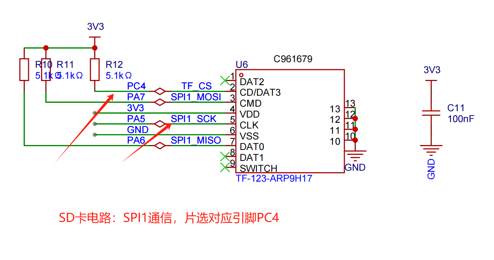
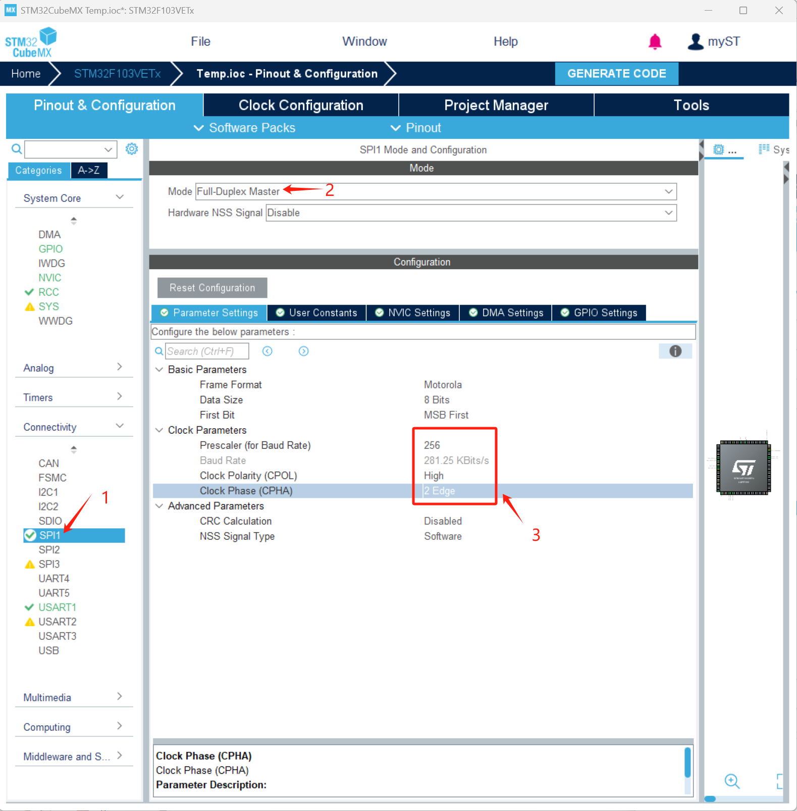
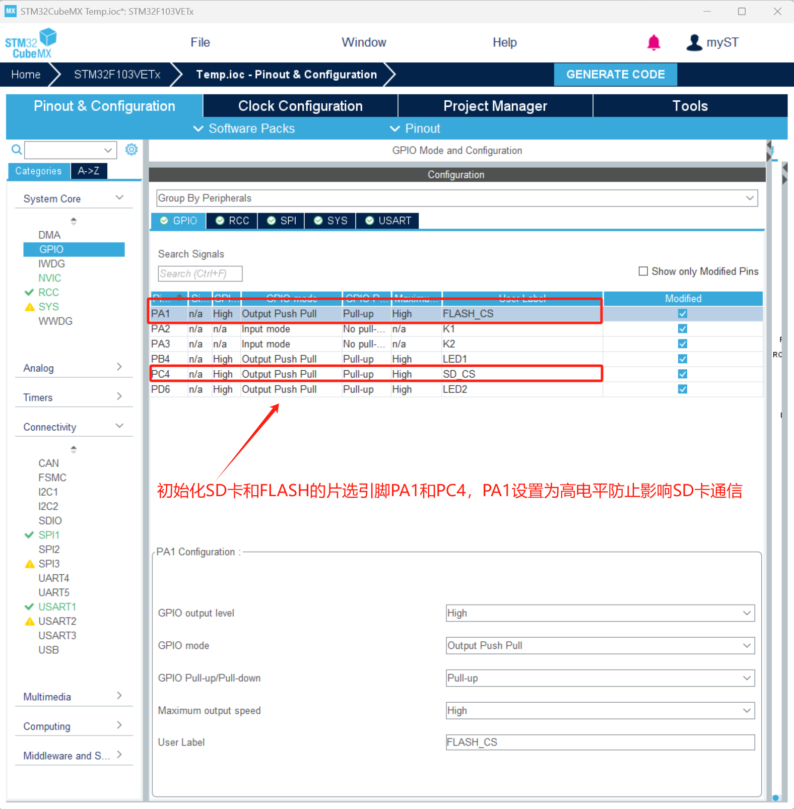
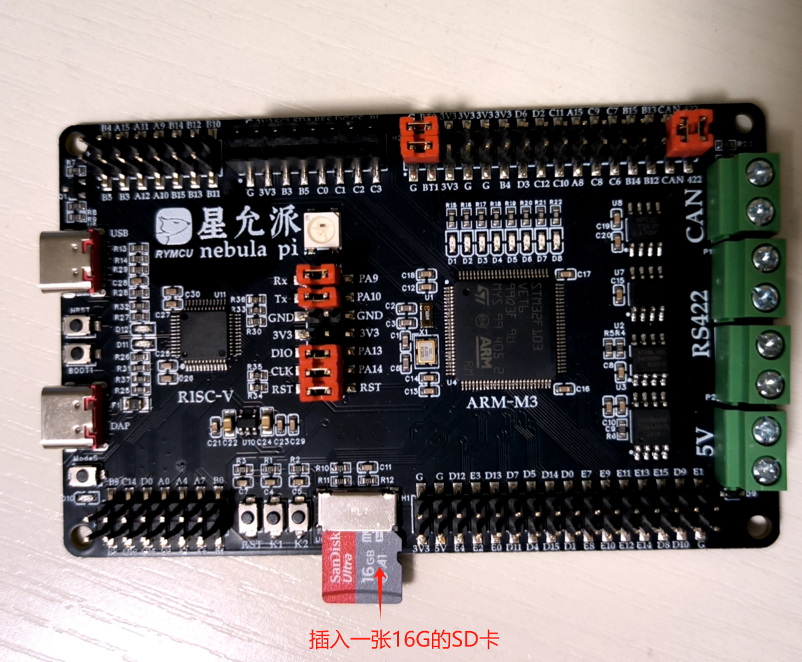
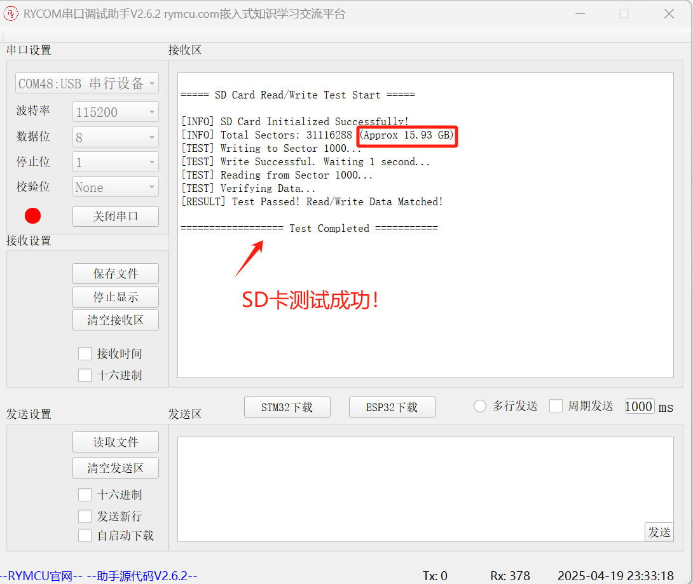

# 第十九章 `SD`卡测试

## 1.前期准备

在第四章工程基础上实现以下功能：

完成`SD`卡驱动编写，并进行读写测试。

## 2.创建项目

星允派将`STM32`芯片`SPI1`与`SD`卡连接，`PC4`作为`SD`的片选信号，电路图如下：



双击`Temp.ioc`，进入`STM32CubeMX`编辑页面，设置 如下。

`SPI`设置



`SD`卡片选设置



## 3.编辑代码

**步骤一：编写`SD`卡驱动代码`bsp_sd_driver.c`和`bsp_sd_driver.h`**

`bsp_sd_driver.h`

```c
#ifndef __SD_CARD_H
#define __SD_CARD_H

#include "stm32f1xx_hal.h"

// SD卡类型定义
#define SD_TYPE_ERR     0x00
#define SD_TYPE_MMC     0x01
#define SD_TYPE_V1      0x02
#define SD_TYPE_V2      0x04
#define SD_TYPE_V2HC    0x06

// SD卡指令表
#define CMD0    0       // 卡复位
#define CMD8    8       // 发送接口条件
#define CMD55   55      // APP命令前缀
#define CMD41   41      // 初始化命令
#define CMD58   58      // 读OCR寄存器
#define CMD17   17      //命令17，读sector
#define CMD24   24      //命令24，写sector
#define CMD9    9       //命令9 ，读CSD数据
#define CMD12   12      //停止数据传送
// 全局变量和函数声明
extern SPI_HandleTypeDef hspi1;
extern uint8_t SD_Type;

uint8_t SD_Init(void);
uint8_t SD_ReadBlock(uint32_t block_addr, uint8_t *buf);
uint8_t SD_WriteBlock(uint32_t block_addr, const uint8_t *buf);
uint32_t SD_GetCapacity(void);
uint8_t SPI_ReadWriteByte(uint8_t data);
#endif /* __SD_CARD_H */

```

`bsp_sd_driver.c`

```c
#include "bsp_sd_card.h"
#include <string.h>

// SPI句柄和片选引脚定义
//SPI_HandleTypeDef hspi1;  // 由CubeMX生成
#define SD_CS_PORT       GPIOC
#define SD_CS_PIN        GPIO_PIN_4

// 私有函数声明
uint8_t SD_CS_Enable(void);
static void SD_CS_Disable(void);
static uint8_t SD_SendCmd(uint8_t cmd, uint32_t arg, uint8_t crc);
static uint8_t SD_GetResponse(uint8_t response, uint32_t timeout);
static uint8_t SD_ReadData(uint8_t *buf, uint16_t len);
static uint8_t SD_WriteData(const uint8_t *buf, uint16_t len);

// SD卡类型
uint8_t SD_Type = 0;

//-----------------------------------------------------
// 等待准备好
//-----------------------------------------------------
uint8_t SD_Wait_Ready(void)
{
  uint8_t r1;
  uint32_t retries = 0x1F;
  do {
    r1 = SPI_ReadWriteByte(0xFF);
    retries--;
  } while ((r1!=0xFF) && retries);

  return r1;//正确返回0xFF
}
//-----------------------------------------------------
// 片选控制
//-----------------------------------------------------
static void SD_CS_Disable(void) {
  HAL_GPIO_WritePin(SD_CS_PORT, SD_CS_PIN, GPIO_PIN_SET);
	SPI_ReadWriteByte(0xFF);//延迟8个时钟
}

uint8_t SD_CS_Enable(void) {
  HAL_GPIO_WritePin(SD_CS_PORT, SD_CS_PIN, GPIO_PIN_RESET);
  if(0xFF == SD_Wait_Ready()) return 0x00;//片选成功
	SD_CS_Disable();
	return 1;//片选失败
	
}
//-----------------------------------------------------
// SPI读写单字节
//-----------------------------------------------------
 uint8_t SPI_ReadWriteByte(uint8_t data) {
  uint8_t rx_data;
  HAL_SPI_TransmitReceive(&hspi1, &data, &rx_data, 1, 100);
  return rx_data;
}

//-----------------------------------------------------
// 发送SD卡命令
//-----------------------------------------------------
static uint8_t SD_SendCmd(uint8_t cmd, uint32_t arg, uint8_t crc) {
  uint8_t tx_buf[6];
  uint8_t r1;
  SD_CS_Disable();
	if(SD_CS_Enable()) return 0xFF;//片选失败
  // 构造命令包
  tx_buf[0] = cmd | 0x40;
  tx_buf[1] = (arg >> 24) & 0xFF;
  tx_buf[2] = (arg >> 16) & 0xFF;
  tx_buf[3] = (arg >> 8) & 0xFF;
  tx_buf[4] = arg & 0xFF;
  tx_buf[5] = crc;

  SD_CS_Enable();
  HAL_SPI_Transmit(&hspi1, tx_buf, 6, 100);
	if(cmd==CMD12)SPI_ReadWriteByte(0xff);
  // 等待响应
  uint32_t retries = 0x1F;
  do {
    r1 = SPI_ReadWriteByte(0xFF);
    retries--;
  } while ((r1 & 0x80) && retries);

  return r1;
}

//-----------------------------------------------------
// SD卡初始化
//-----------------------------------------------------
uint8_t SD_Init(void) {
  uint8_t r1;
  uint32_t retries;
  uint8_t ocr[4];

  // 配置SPI低速模式（CubeMX默认配置）
  hspi1.Init.BaudRatePrescaler = SPI_BAUDRATEPRESCALER_256;
  HAL_SPI_Init(&hspi1);

  // 发送至少74个时钟脉冲
  SD_CS_Disable();
  for (int i=0; i<10; i++) SPI_ReadWriteByte(0xFF);

  // CMD0: 复位到空闲状态
  retries = 20;
  do {
    r1 = SD_SendCmd(CMD0, 0, 0x95);
  } while (r1 != 0x01 && retries--);
  if (r1 != 0x01) return 1;

  // CMD8: 检查SD卡版本
  if (SD_SendCmd(CMD8, 0x1AA, 0x87) == 0x01) {
    // SD V2.0+
    for (int i=0; i<4; i++) ocr[i] = SPI_ReadWriteByte(0xFF);
    if (ocr[2] != 0x01 || ocr[3] != 0xAA) return 2;

    // ACMD41初始化
    retries = 0xFFF;
    do {
      SD_SendCmd(CMD55, 0, 0x01);
      r1 = SD_SendCmd(CMD41, 0x40000000, 0x01);
    } while (r1 != 0x00 && retries--);
    if (retries == 0) return 3;

    // 检查是否支持高容量
    SD_SendCmd(CMD58, 0, 0x01);
    for (int i=0; i<4; i++) ocr[i] = SPI_ReadWriteByte(0xFF);
    SD_Type = (ocr[0] & 0x40) ? SD_TYPE_V2HC : SD_TYPE_V2;
  } else {
    // SD V1.x或MMC卡
    SD_SendCmd(CMD55, 0, 0x01);
    r1 = SD_SendCmd(CMD41, 0, 0x01);
    SD_Type = (r1 <= 1) ? SD_TYPE_V1 : SD_TYPE_MMC;
  }

  // 切换SPI到高速模式
  hspi1.Init.BaudRatePrescaler = SPI_BAUDRATEPRESCALER_4;
  HAL_SPI_Init(&hspi1);
  SD_CS_Disable();
  return 0;
}

//-----------------------------------------------------
// 读取单个块（512字节）
//-----------------------------------------------------
uint8_t SD_ReadBlock(uint32_t block_addr, uint8_t *buf) {
  if (SD_Type != SD_TYPE_V2HC) block_addr <<= 9; // 字节地址转换

  uint8_t r1 = SD_SendCmd(CMD17, block_addr, 0x01);
  if (r1 != 0x00) return 1;

  // 等待数据令牌
  uint32_t timeout = 100000;
  while (SPI_ReadWriteByte(0xFF) != 0xFE && timeout--);
  if (!timeout) return 2;

  // 读取数据
  HAL_SPI_Receive(&hspi1, buf, 512, 100);
  SPI_ReadWriteByte(0xFF); // 忽略CRC
  SPI_ReadWriteByte(0xFF);
  SD_CS_Disable();
  return 0;
}

//-----------------------------------------------------
// 写入单个块（512字节）
//-----------------------------------------------------
uint8_t SD_WriteBlock(uint32_t block_addr, const uint8_t *buf) {
  if (SD_Type != SD_TYPE_V2HC) block_addr <<= 9;

  uint8_t r1 = SD_SendCmd(CMD24, block_addr, 0x01);
  if (r1 != 0x00) return 1;

  // 发送数据前缀
  SPI_ReadWriteByte(0xFE);
  HAL_SPI_Transmit(&hspi1, (uint8_t*)buf, 512, 100);

  // 发送伪CRC和检查响应
  SPI_ReadWriteByte(0xFF);
  SPI_ReadWriteByte(0xFF);
  uint8_t resp = SPI_ReadWriteByte(0xFF);
  if ((resp & 0x1F) != 0x05) return 2;

  SD_CS_Disable();
  return 0;
}
// sd_card.c 中添加以下代码

// 从CSD寄存器获取容量（扇区数）
uint32_t SD_GetCapacity(void) {
    uint8_t csd[16];
    uint32_t capacity = 0;
    uint8_t ret;

    SD_CS_Enable();
    ret = SD_SendCmd(CMD9, 0, 0x01); // 发送CMD9读取CSD
    if (ret != 0x00) {
        SD_CS_Disable();
        return 0; // 读取失败
    }

    // 等待数据令牌0xFE
    uint32_t timeout = 100000;
    while (SPI_ReadWriteByte(0xFF) != 0xFE && timeout--);
    if (!timeout) {
        SD_CS_Disable();
        return 0; // 超时
    }

    // 读取16字节CSD数据
    HAL_SPI_Receive(&hspi1, csd, 16, 100);
    SPI_ReadWriteByte(0xFF); // 忽略CRC
    SPI_ReadWriteByte(0xFF);
    SD_CS_Disable();

    // 解析CSD数据
    if ((csd[0] & 0xC0) == 0x40) { // SDHC/SDXC卡（CSD版本2.0）
        uint32_t csize = ((uint32_t)(csd[7] & 0x3F) << 16) 
                       | ((uint32_t)csd[8] << 8)
                       | csd[9];
        capacity = (csize + 1) * 1024; // 每块大小固定为512字节，故容量 = (csize+1)*512*1024/512
    } else { // 标准容量卡（CSD版本1.0）
        uint8_t read_bl_len = csd[5] & 0x0F;
        uint16_t c_size = ((csd[6] & 0x03) << 10)
                        | (csd[7] << 2)
                        | ((csd[8] >> 6) & 0x03);
        uint8_t c_size_mult = ((csd[9] & 0x03) << 1)
                            | ((csd[10] >> 7) & 0x01);
        capacity = (uint32_t)(c_size + 1) << (c_size_mult + read_bl_len - 7);
    }

    return capacity; // 返回总扇区数
}
```

**步骤二：修改`main.c`**

添加`SD`卡驱动头文件

```c
#include "bsp_sd_card.h"
```

添加测试函数初始化

```c

/* USER CODE BEGIN PFP */
// 测试用缓冲区
uint8_t write_buffer[512];
uint8_t read_buffer[512];

// 填充测试数据（0x00~0xFF循环）
void fill_test_pattern(uint8_t* buf) {
    for (uint16_t i = 0; i < 512; i++) {
        buf[i] = i % 256;
    }
}

// 数据校验函数
uint8_t verify_data(uint8_t* buf1, uint8_t* buf2) {
    for (uint16_t i = 0; i < 512; i++) {
        if (buf1[i] != buf2[i]) {
          printf("Data is inconsistent @ offset %d: Written=0x%02X, Read=0x%02X\r\n", i, buf1[i], buf2[i]);
            return 0;
        }
    }
    return 1;
}
/* USER CODE END PFP */
```

`main`函数添加测试代码

```c
  /* USER CODE BEGIN 2 */
  printf("\r\n===== SD Card Read/Write Test Start =====\r\n\r\n");

  // 1. Initialize SD Card
  uint8_t ret = SD_Init();
  if (ret != 0) {
      printf("[ERROR] SD Card Initialization Failed. Error Code: 0x%02X\r\n", ret);
      while(1); // Halt if initialization fails
  }
  printf("[INFO] SD Card Initialized Successfully!\r\n");

  // 2. Get and Display Capacity Information
  uint32_t capacity = SD_GetCapacity();
  printf("[INFO] Total Sectors: %lu (Approx %.2f GB)\r\n", 
         capacity, (float)capacity * 512 / 1000 / 1000 / 1000);

  // 3. Prepare Test Data
  fill_test_pattern(write_buffer);
  const uint32_t test_sector = 1000; // Test sector (avoid overwriting critical data)

  // 4. Write Test
  printf("[TEST] Writing to Sector %lu...\r\n", test_sector);
  ret = SD_WriteBlock(test_sector, write_buffer);
  if (ret != 0) {
      printf("[ERROR] Sector Write Failed. Error Code: 0x%02X\r\n", ret);
      while(1);
  }
  printf("[TEST] Write Successful. Waiting 1 second...\r\n");
  HAL_Delay(1000); // Ensure data is physically written

  // 5. Read Test
  printf("[TEST] Reading from Sector %lu...\r\n", test_sector);
  ret = SD_ReadBlock(test_sector, read_buffer);
  if (ret != 0) {
      printf("[ERROR] Sector Read Failed. Error Code: 0x%02X\r\n", ret);
      while(1);
  }

  // 6. Data Verification
  printf("[TEST] Verifying Data...\r\n");
  if (verify_data(write_buffer, read_buffer)) {
      printf("[RESULT] Test Passed! Read/Write Data Matched!\r\n");
  } else {
      printf("[ERROR] Test Failed! Data Mismatch Detected!\r\n");
  }
  printf("\r\n================== Test Completed ===========\r\n");
  /* USER CODE END 2 */
```

**步骤三：添加配置**

`keil`开发请忽略，`vscode + platformio`环境，请在`platformio.ini`中添加支持`printf`浮点数输出设置。

```ini
; 添加以下编译选项
build_flags =
    -Wl,-u,_printf_float   ; 启用 printf 浮点支持
```

## 4.下载验证

本次测试中,开发板插入一张`16GB`的`SD`卡。



结果如下:



## 5.小结


本章实现了`SD`卡驱动,并读写测试成功。