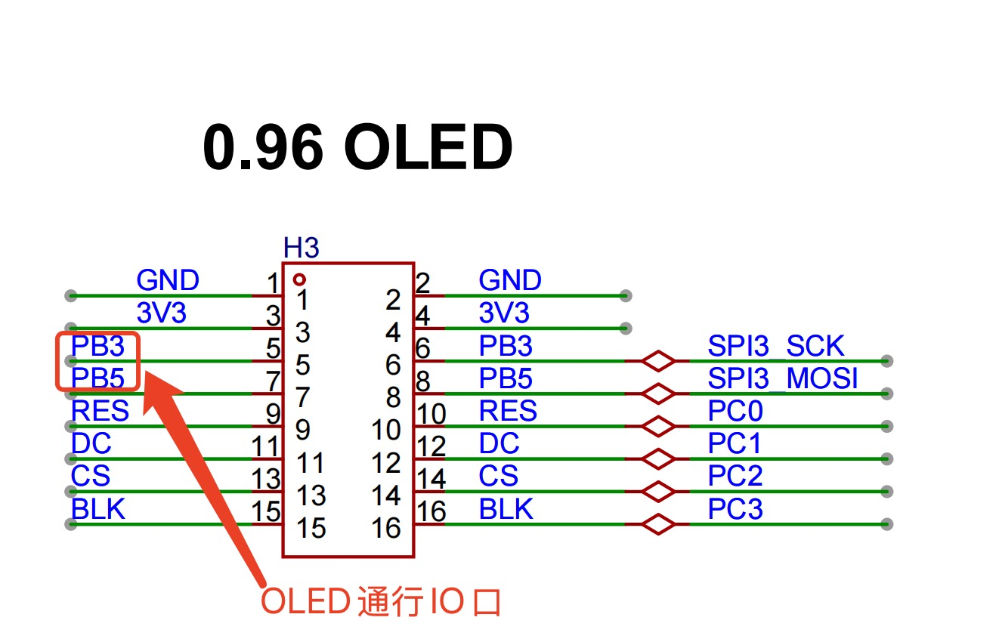
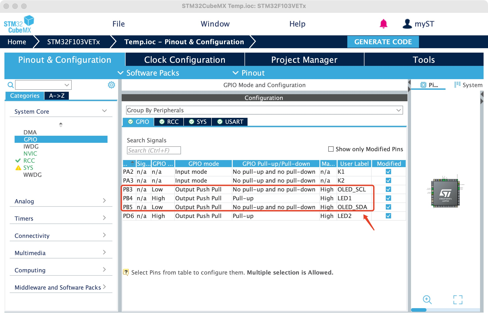
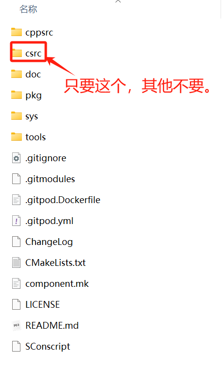
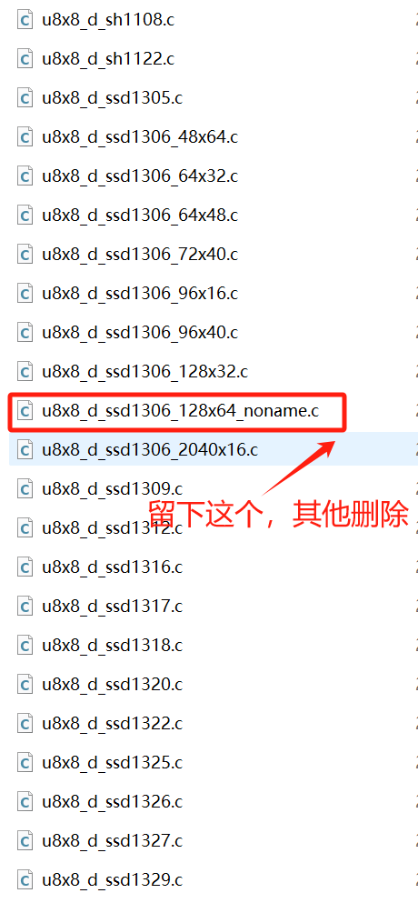
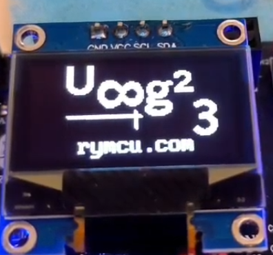

# 第二十章 `OLED`移植`u8g2`

## 1.  前期准备

`u8g2` 是一个轻量级、开源的 单色图形库，专为嵌入式系统设计，用于驱动各种单色 `OLED `和 `LCD `显示屏（如 `SSD1306`、`SH1106` 等）。它支持多种通信接口（`I2C`、`SPI`、并行接口），无需操作系统支持，可运行在资源有限的微控制器（如 `Arduino`、`STM32`、`ESP8266/ESP32` 等）上，是嵌入式设备显示界面开发的常用工具。

在第四章《串口通信》基础上实现，为`0.96`寸`OLED`移植`u8g2`。

## 2.创建项目

星允派使用`PB3`，`PB5`模拟`I2C`通信，实现`OLED`的读写工程。原理图`IO`口安排如下。



`PB3`,`PB5`分别命名为`OLED_SCL`,`OLED_SDA`,设置为输出模式。



## 2.`keil`开发环境

`keil`开发环境下需要下载`u8g2`源码，并添加至工程中，`vscode + Platformio`开发请跳过本小节。

**步骤一： 下载官方`u8g2`官方源代码**

从 `GitHub` 仓库下载最新版 `u8g2`：https://github.com/olikraus/U8g2

解压后目录如下，只需要`csrc`文件夹复制到`Keil`工程目录，其他删除即可。



**步骤二： 删除非必要显示器驱动文件**

`scrc`文件夹中`u8x8_d_xx.c`为不同型号显示器驱动，星允派使用`0.96 OLED`驱动芯片为`SSD1306`。留下`u8x8_d_ssd1306_128x64_noname.c`,节省空间删除其他显示芯片驱动。



**把上述文件添加至`keil`工程，并记得添加对应的头文件路径。**

**步骤三： 修改`u8g2`源文件**

**修改`u8g2_d_setup.c`**：保留`u8g2_Setup_ssd1306_i2c_128x64_noname_f`函数，其他均注释。

```c
#include "u8g2.h"

/* ssd1306 f */
void u8g2_Setup_ssd1306_i2c_128x64_noname_f(u8g2_t *u8g2, const u8g2_cb_t *rotation, u8x8_msg_cb byte_cb, u8x8_msg_cb gpio_and_delay_cb)
{
  uint8_t tile_buf_height;
  uint8_t *buf;
  u8g2_SetupDisplay(u8g2, u8x8_d_ssd1306_128x64_noname, u8x8_cad_ssd13xx_fast_i2c, byte_cb, gpio_and_delay_cb);
  buf = u8g2_m_16_8_f(&tile_buf_height);
  u8g2_SetupBuffer(u8g2, buf, tile_buf_height, u8g2_ll_hvline_vertical_top_lsb, rotation);
}

/* end of generated code */
```

**修改`u8g2_d_memory.c`**：保留上一步中用到的`u8g2_m_16_8_f`函数，其他均注释。

```c

#include "u8g2.h"

uint8_t *u8g2_m_16_8_f(uint8_t *page_cnt)
{
  #ifdef U8G2_USE_DYNAMIC_ALLOC
  *page_cnt = 8;
  return 0;
  #else
  static uint8_t buf[1024];
  *page_cnt = 8;
  return buf;
  #endif
}

/* end of generated code */
```

## 3.`vscode + Platformio`开发环境

`Keil`开发环境请跳过本小节。

**修改配置文件`platformio.ini`**：修改配置文件，添加`u8g2`库`lib_deps = olikraus/U8g2@^2.36.5`，并添加库文件路径，如下所示：

```ini
[env:rymcu_nebulapi_f103ve]
platform = ststm32
board = rymcu_nebulapi_f103ve

upload_protocol = cmsis-dap
lib_deps = olikraus/U8g2@^2.36.5
build_flags =
 -DUSE_HAL_DRIVER
 -DSTM32F103xE

 -ICore/Inc 
 -IDrivers/STM32F1xx_HAL_Driver/Inc 
 -IDrivers/STM32F1xx_HAL_Driver/Inc/Legacy 
 -IDrivers/CMSIS/Device/ST/STM32F1xx/Include 
 -IDrivers/CMSIS/Include 
 -I.pio/libdeps/rymcu_nebulapi_f103ve/U8g2/src/clib

build_src_filter = +<Core/Src> +<Drivers/> +<.pio/libdeps/rymcu_nebulapi_f103ve/U8g2/src/clib> +<startup_stm32f103xe.s>
board_build.ldscript = ./STM32F103VETx_FLASH.ld
extra_scripts = post:copy_bin_to_root.py
[platformio]
src_dir = ./
```

## 4.代码编辑

**步骤一：创建`bsp_oled.h`，`bsp_oled.c`文件，用于完成初始化及测试代码**

`bsp_oled.h`

```c
#ifndef __OLED_H
#define __OLED_H

#include "stm32f1xx_hal.h"
#include  "u8g2.h"
#include "u8x8.h"

// 全局U8g2对象声明
extern u8g2_t u8g2;

// OLED初始化函数
void OLED_Init(void);
void OLED_DisplayString(uint8_t x, uint8_t y, const char *str);
#endif /* __OLED_H */

```

`bsp_oled.c`

```c
#include "bsp_oled.h"

// 定义模拟I2C引脚
#define SCL_PIN    GPIO_PIN_3
#define SCL_PORT   GPIOB
#define SDA_PIN    GPIO_PIN_5
#define SDA_PORT   GPIOB

// 私有函数声明
uint8_t u8g2_gpio_and_delay_stm32_soft_iic(U8X8_UNUSED u8x8_t *u8x8, U8X8_UNUSED uint8_t msg, U8X8_UNUSED uint8_t arg_int, U8X8_UNUSED void *arg_ptr);
void u8g2_logo(u8g2_t *u8g2)
{
		uint8_t x0=20;
	u8g2_ClearBuffer(u8g2); 
    u8g2_SetFontMode(u8g2, 1); 
    u8g2_SetFontDirection(u8g2, 0); 
    u8g2_SetFont(u8g2, u8g2_font_inb24_mf);
    u8g2_DrawStr(u8g2, x0, 20, "U");
    
    u8g2_SetFontDirection(u8g2, 1);
    u8g2_SetFont(u8g2, u8g2_font_inb30_mn);
    u8g2_DrawStr(u8g2, 21+x0,8,"8");
        
    u8g2_SetFontDirection(u8g2, 0);
    u8g2_SetFont(u8g2, u8g2_font_inb24_mf);
    u8g2_DrawStr(u8g2, 51+x0,30,"g");
    u8g2_DrawStr(u8g2, 67+x0,30,"\xb2");
    
    u8g2_DrawHLine(u8g2, 2+x0, 35, 47);
    u8g2_DrawHLine(u8g2, 3+x0, 36, 47);
    u8g2_DrawVLine(u8g2, 45+x0, 32, 12);
    u8g2_DrawVLine(u8g2, 46+x0, 33, 12);
  
    u8g2_SetFont(u8g2, u8g2_font_pxplusibmvga8_m_all);
    u8g2_DrawStr(u8g2, 30,60,"rymcu.com");
	
		u8g2_SendBuffer(u8g2);
		HAL_Delay(1000);
}
//---------------------------------------------------------------------
// OLED初始化函数
//---------------------------------------------------------------------
void OLED_Init(void) {
  u8g2_Setup_ssd1306_i2c_128x64_noname_f(&u8g2, U8G2_R0, u8x8_byte_sw_i2c,u8g2_gpio_and_delay_stm32_soft_iic);
	u8g2_InitDisplay(&u8g2); 
	u8g2_SetPowerSave(&u8g2,0);
	u8g2_ClearBuffer(&u8g2);
	HAL_Delay(1000);
	u8g2_logo(&u8g2);
}

//---------------------------------------------------------------------
// 显示字符串函数（示例）
//---------------------------------------------------------------------
void OLED_DisplayString(uint8_t x, uint8_t y, const char *str) {
  u8g2_DrawStr(&u8g2, x, y, str);
  u8g2_SendBuffer(&u8g2);
}
//---------------------------------------------------------------------
// us延时函数
//---------------------------------------------------------------------
void delay_us(uint32_t us)
{
    uint32_t ticks;
    uint32_t told, tnow, tcnt = 0;
    uint32_t reload = SysTick->LOAD;

    ticks = us * (HAL_RCC_GetHCLKFreq() / 1000000);
    told = SysTick->VAL;

    while (1)
    {
        tnow = SysTick->VAL;
        if (tnow != told)
        {
            if (tnow < told)
            {
                tcnt += told - tnow;
            }
            else
            {
                tcnt += reload - tnow + told;
            }
            told = tnow;
            if (tcnt >= ticks)
            {
                break;
            }
        }
    }
}
//---------------------------------------------------------------------
// 软件I2C
//---------------------------------------------------------------------
uint8_t u8g2_gpio_and_delay_stm32_soft_iic(U8X8_UNUSED u8x8_t *u8x8, U8X8_UNUSED uint8_t msg, U8X8_UNUSED uint8_t arg_int, U8X8_UNUSED void *arg_ptr)
{
	switch(msg){
			case U8X8_MSG_DELAY_MILLI:
				HAL_Delay(arg_int);
			break;
			case U8X8_MSG_DELAY_10MICRO:
				delay_us(10);
			break;	
			case U8X8_MSG_DELAY_100NANO:
				__NOP();
			break;
			case U8X8_MSG_GPIO_I2C_CLOCK:
				if (arg_int) HAL_GPIO_WritePin(SCL_PORT,SCL_PIN,GPIO_PIN_SET);
				else HAL_GPIO_WritePin(SCL_PORT,SCL_PIN,GPIO_PIN_RESET);
			break;
			case U8X8_MSG_GPIO_I2C_DATA:
				if (arg_int) HAL_GPIO_WritePin(SDA_PORT,SDA_PIN,GPIO_PIN_SET);
				else HAL_GPIO_WritePin(SDA_PORT,SDA_PIN,GPIO_PIN_RESET);;
			break;
			default:
				return 0; 
	}
	return 1; 
}
```

上述代码中，`OLED` 初始化函数 `OLED_Init`，完成了:

a.`u8g2`硬件配置，使用 软件` I2C` 通信。

```c
u8g2_Setup_ssd1306_i2c_128x64_noname_f(
    &u8g2,                // u8g2 对象指针
    U8G2_R0,              // 旋转模式（0°）
    u8x8_byte_sw_i2c,     // I2C 字节传输函数（u8g2 内置）
    u8g2_gpio_and_delay_stm32_soft_iic  // 自定义 GPIO 与延时函数
);
```

b.`u8g2_InitDisplay` 初始化硬件，`u8g2_SetPowerSave(0)` 唤醒显示屏；

c.`u8g2_logo(&u8g2)`在` OLED`上绘制`U8g2`标志和网址 "[rymcu.com](https://rymcu.com/)"。

**步骤二：修改`main.c`**

添加头文件：

```c
#include "bsp_oled.h" 
```

添加全局变量：

```c
/* USER CODE BEGIN PV */
u8g2_t u8g2;
uint8_t i;
unsigned char str_temp[]="0";
unsigned char str_temp_b[]="0";
/* USER CODE END PV */
```

`main()`函数添加测试代码：

```c
  /* USER CODE BEGIN 2 */
  OLED_Init();
  /* USER CODE END 2 */

  /* Infinite loop */
  /* USER CODE BEGIN WHILE */
  while (1)
  {
    /* USER CODE END WHILE */

    /* USER CODE BEGIN 3 */
		i++;
		if(i>9)i=0;
		
		str_temp[0] = '0' + i; 
		u8g2_SetFont(&u8g2, u8g2_font_inb24_mf);
		u8g2_SetDrawColor(&u8g2, 0); // 设置为背景色，用于擦除旧字符
    u8g2_DrawStr(&u8g2, 100,50,(const char*)str_temp_b);
		u8g2_SetDrawColor(&u8g2, 1);  // 设置为前景色，用于绘制新字符
    u8g2_DrawStr(&u8g2, 100,50,(const char*)str_temp);
		u8g2_SendBuffer(&u8g2);
		str_temp_b[0] = str_temp[0];
		HAL_GPIO_TogglePin(LED2_GPIO_Port,LED2_Pin);
		HAL_Delay(1000);
  }
  /* USER CODE END 3 */
```


## 4.编译下载

将程序编译下载至开发板，观察`OLED`显示效果，最后显示效果如下：



## 5.小结

本章学习了`OLED`移植`u8g2`。

