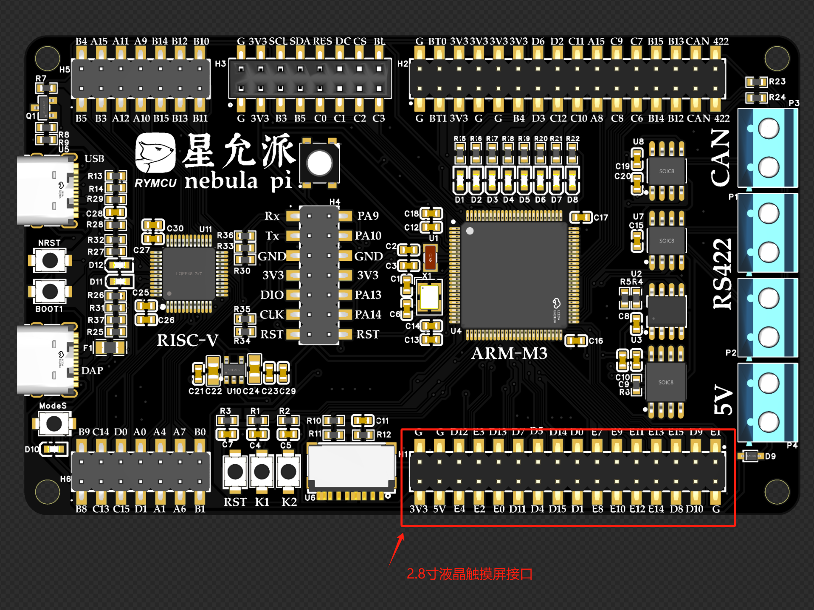
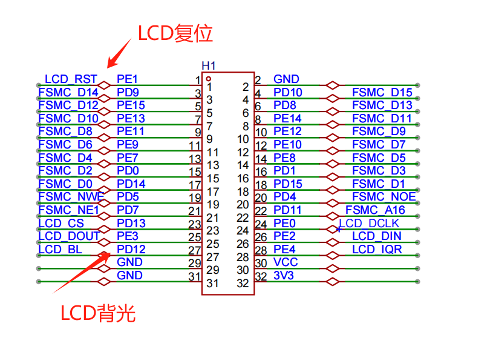
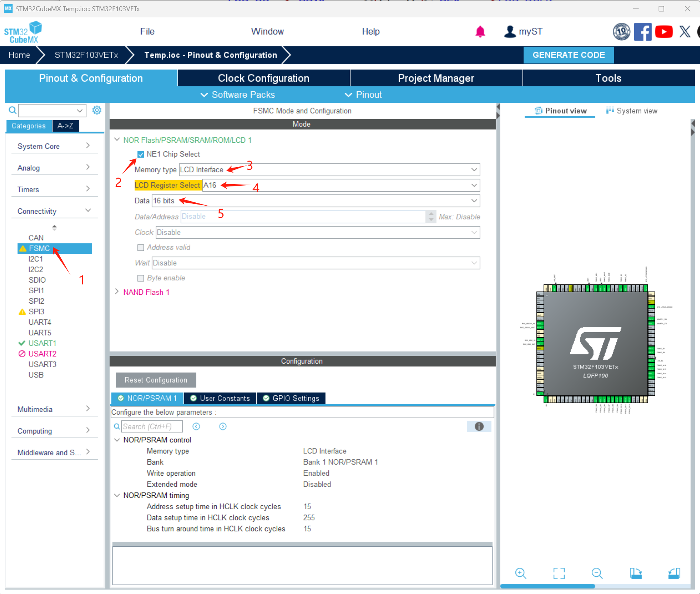

#  第二十一章 `2.8`寸触摸显示屏测试

## 1.前期准备

在第四章工程基础上实现以下功能：

液晶显示屏显示图形。

## 2.创建项目

星允派使用 `STM32F103VET6` 的`FSMC`接口（`8080`并行模式）连接`2.8`寸触摸显示屏(`240x320`)。



原理图如下：



其中，`PE1`，`PD12`分别对应液晶显示器`LCD`的复位（`LCD_RST`）和背光(`LCD_BL`)引脚，`FSMC`与`LCD`对应关系如下：

| `FSMC`信号  | `LCD`引脚                          |
| :---------- | :--------------------------------- |
| **`D0-D1`** | 按需连接至`LCD`数据线              |
| **`A10`**   | 连接至`LCD`的`RS`（命令/数据选择） |
| **`NE1`**   | 连接至`LCD`的片选（`CS`）          |
| **`NOE`**   | 连接至`LCD`的读使能（`RD`）        |
| **`NWE`**   | 连接至`LCD`的写使能（`WR`）        |

双击`Temp.ioc`，进入`STM32CubeMX`编辑页面

**步骤一：设置`FSMC`**



**步骤二：设置`GPIO`**


## 3.编辑代码

### 3.1.`LCD`驱动代码

使用`deepseek`生成兼容`ILI9341` 和 `ST7789V` 显示屏的驱动代码，基于`STM32F103VET6` 的 `FSMC接口`（`8080`并行模式），代码模块化分为 `.c` 和 `.h` 文件。

#### **头文件 `bsp_lcd_driver.h`**

```c
#ifndef __BSP_LCD_DRIVER_H
#define __BSP_LCD_DRIVER_H

#include "stm32f1xx_hal.h"

#define LCD_WIDTH   240   // 屏幕宽度
#define LCD_HEIGHT  320   // 屏幕高度

static uint16_t LCD_X_LENGTH = 240;
static uint16_t LCD_Y_LENGTH = 320;
static uint8_t LCD_SCAN_MODE = 0;

#define ILI9341_LESS_PIXEL  240
#define ILI9341_MORE_PIXEL  320
//-------------------------------
// LCD型号枚举
//-------------------------------
typedef enum {
    LCD_UNKNOWN = 0,
    LCD_ILI9341,
    LCD_ST7789V
} LCD_TypeDef;

//-------------------------------
// FSMC地址定义（A16=RS）
//-------------------------------
#define LCD_CMD_ADDR   ((uint32_t)0x60000000)  // RS=0（命令）
#define LCD_DATA_ADDR  ((uint32_t)0x60020000)  // RS=1（数据，A16=1）

//-------------------------------
// 颜色格式（RGB565）
//-------------------------------
typedef uint16_t LCD_ColorTypeDef;

//-------------------------------
// 函数声明
//-------------------------------
LCD_TypeDef LCD_DetectModel(void);  // 检测LCD型号
void LCD_Init(void);                // 初始化LCD
void LCD_SetWindow(uint16_t x0, uint16_t y0, uint16_t x1, uint16_t y1);
void LCD_FillColor(LCD_ColorTypeDef color);
void LCD_DrawPixel(uint16_t x, uint16_t y, LCD_ColorTypeDef color);
void LCD_SetGramScan(uint8_t scan_mode);
void ry_lcd_fill(uint16_t x_start,uint16_t y_start,uint16_t x_end,uint16_t y_end,uint8_t* color);
#endif /* __BSP_LCD_DRIVER_H */
```

**源文件 `bsp_lcd_driver.c`**

```c
#include "bsp_lcd_driver.h"
#include "main.h"
//-------------------------------
// 全局变量
//-------------------------------
static LCD_TypeDef lcd_model = LCD_UNKNOWN;  // 存储检测到的LCD型号

//-------------------------------
// 底层FSMC操作宏
//-------------------------------
#define LCD_WriteCmd(cmd)    (*(__IO uint16_t *)LCD_CMD_ADDR = (cmd))
#define LCD_WriteData(data)  (*(__IO uint16_t *)LCD_DATA_ADDR = (data))

//-------------------------------
// LCD型号检测（通过读取ID）
//-------------------------------
LCD_TypeDef LCD_DetectModel(void) {
    LCD_WriteCmd(0x04);   // 发送读取ID命令（ILI9341/ST7789V通用）
    HAL_Delay(5);
		uint16_t id=0;
		id = *(__IO uint16_t *)LCD_DATA_ADDR; // 读取ID
		id = *(__IO uint16_t *)LCD_DATA_ADDR; // 读取ID
		id = *(__IO uint16_t *)LCD_DATA_ADDR; // 读取ID
		id <<= 8;
		id |= *(__IO uint16_t *)LCD_DATA_ADDR; // 读取ID
    if (id == 0x9341) {         // ILI9341的ID为0x9341
        return LCD_ILI9341;
    } else if (id == 0x8552) {  // ST7789V的ID为0x8552//0x7789
        return LCD_ST7789V;
    } else {
        return LCD_UNKNOWN;     // 未知型号
    }
}

//-------------------------------
// LCD初始化（动态适配型号）
//-------------------------------
void LCD_Init(void) {
// 打开背光
    HAL_GPIO_WritePin(LCD_BL_GPIO_Port, LCD_BL_Pin, GPIO_PIN_RESET);
    HAL_Delay(100);
    // 硬件复位
    HAL_GPIO_WritePin(LCD_RST_GPIO_Port, LCD_RST_Pin, GPIO_PIN_RESET);
    HAL_Delay(100);
    HAL_GPIO_WritePin(LCD_RST_GPIO_Port, LCD_RST_Pin, GPIO_PIN_SET);
    HAL_Delay(120);

    // 检测LCD型号
    lcd_model = LCD_DetectModel();
    if (lcd_model == LCD_UNKNOWN) {
        while(1); // 检测失败，死循环（可替换为错误处理）
    }

    // 根据型号加载初始化序列
    switch (lcd_model) {
        case LCD_ILI9341:
            // ILI9341初始化序列
            LCD_WriteCmd(0xCF); LCD_WriteData(0x00); LCD_WriteData(0xC1); LCD_WriteData(0x30);
            LCD_WriteCmd(0xED); LCD_WriteData(0x64); LCD_WriteData(0x03); LCD_WriteData(0x12); LCD_WriteData(0x81);
            LCD_WriteCmd(0xE8); LCD_WriteData(0x85); LCD_WriteData(0x10); LCD_WriteData(0x7A);
            LCD_WriteCmd(0xCB); LCD_WriteData(0x39); LCD_WriteData(0x2C); LCD_WriteData(0x00); LCD_WriteData(0x34); LCD_WriteData(0x02);
            LCD_WriteCmd(0xF7); LCD_WriteData(0x20);
            LCD_WriteCmd(0xEA); LCD_WriteData(0x00); LCD_WriteData(0x00);
            LCD_WriteCmd(0xC0); LCD_WriteData(0x1B);   // Power Control 1
            LCD_WriteCmd(0xC1); LCD_WriteData(0x12);   // Power Control 2
            LCD_WriteCmd(0xC5); LCD_WriteData(0x3F); LCD_WriteData(0x3C); // VCOM Control
            LCD_WriteCmd(0xC7); LCD_WriteData(0x91);   // VCOM Offset
            LCD_WriteCmd(0x36); LCD_WriteData(0x48);   // Memory Access Control
            LCD_WriteCmd(0x3A); LCD_WriteData(0x55);   // Pixel Format (RGB565)
            LCD_WriteCmd(0xB1); LCD_WriteData(0x00); LCD_WriteData(0x18); // Frame Rate Control
            LCD_WriteCmd(0xB6); LCD_WriteData(0x0A); LCD_WriteData(0xA2); // Display Function Control
            LCD_WriteCmd(0xF2); LCD_WriteData(0x00);   // Gamma Function Disable
            LCD_WriteCmd(0x26); LCD_WriteData(0x01);   // Gamma Set
            // Positive Gamma Correction
            LCD_WriteCmd(0xE0);
            LCD_WriteData(0x0F); LCD_WriteData(0x31); LCD_WriteData(0x2B); LCD_WriteData(0x0C);
            LCD_WriteData(0x0E); LCD_WriteData(0x08); LCD_WriteData(0x4E); LCD_WriteData(0xF1);
            LCD_WriteData(0x37); LCD_WriteData(0x07); LCD_WriteData(0x10); LCD_WriteData(0x03);
            LCD_WriteData(0x0E); LCD_WriteData(0x09); LCD_WriteData(0x00);
            // Negative Gamma Correction
            LCD_WriteCmd(0xE1);
            LCD_WriteData(0x00); LCD_WriteData(0x0E); LCD_WriteData(0x14); LCD_WriteData(0x03);
            LCD_WriteData(0x11); LCD_WriteData(0x07); LCD_WriteData(0x31); LCD_WriteData(0xC1);
            LCD_WriteData(0x48); LCD_WriteData(0x08); LCD_WriteData(0x0F); LCD_WriteData(0x0C);
            LCD_WriteData(0x31); LCD_WriteData(0x36); LCD_WriteData(0x0F);
            LCD_WriteCmd(0x29);   // Display ON
            break;
     
        case LCD_ST7789V:
            //------------- ST7789V 初始化序列（用户提供）-------------
            LCD_WriteCmd(0xCF);
            LCD_WriteData(0x00);
            LCD_WriteData(0xC1);
            LCD_WriteData(0x30);

            LCD_WriteCmd(0xED);
            LCD_WriteData(0x64);
            LCD_WriteData(0x03);
            LCD_WriteData(0x12);
            LCD_WriteData(0x81);

            LCD_WriteCmd(0xE8);
            LCD_WriteData(0x85);
            LCD_WriteData(0x10);
            LCD_WriteData(0x78);

            LCD_WriteCmd(0xCB);
            LCD_WriteData(0x39);
            LCD_WriteData(0x2C);
            LCD_WriteData(0x00);
            LCD_WriteData(0x34);
            LCD_WriteData(0x02);

            LCD_WriteCmd(0xF7);
            LCD_WriteData(0x20);

            LCD_WriteCmd(0xEA);
            LCD_WriteData(0x00);
            LCD_WriteData(0x00);

            LCD_WriteCmd(0xC0);
            LCD_WriteData(0x21);

            LCD_WriteCmd(0xC1);
            LCD_WriteData(0x11);

            LCD_WriteCmd(0xC5);
            LCD_WriteData(0x2D);
            LCD_WriteData(0x33);

            LCD_WriteCmd(0x36);
            LCD_WriteData(0x00); // 显示方向（可调整）

            LCD_WriteCmd(0x3A);
            LCD_WriteData(0x55); // RGB565

            LCD_WriteCmd(0xB1);
            LCD_WriteData(0x00);
            LCD_WriteData(0x17);

            LCD_WriteCmd(0xB6);
            LCD_WriteData(0x0A);
            LCD_WriteData(0xA2);

            LCD_WriteCmd(0xF6);
            LCD_WriteData(0x01);
            LCD_WriteData(0x30);

            LCD_WriteCmd(0xF2);
            LCD_WriteData(0x00);

            LCD_WriteCmd(0x26);
            LCD_WriteData(0x01);

            // Positive Gamma
            LCD_WriteCmd(0xE0);
            LCD_WriteData(0xD0); LCD_WriteData(0x00); LCD_WriteData(0x02);
            LCD_WriteData(0x07); LCD_WriteData(0x0B); LCD_WriteData(0x1A);
            LCD_WriteData(0x31); LCD_WriteData(0x54); LCD_WriteData(0x40);
            LCD_WriteData(0x29); LCD_WriteData(0x12); LCD_WriteData(0x12);
            LCD_WriteData(0x12); LCD_WriteData(0x17);

            // Negative Gamma
            LCD_WriteCmd(0xE1);
            LCD_WriteData(0xD0); LCD_WriteData(0x00); LCD_WriteData(0x02);
            LCD_WriteData(0x07); LCD_WriteData(0x05); LCD_WriteData(0x25);
            LCD_WriteData(0x2D); LCD_WriteData(0x44); LCD_WriteData(0x45);
            LCD_WriteData(0x1C); LCD_WriteData(0x18); LCD_WriteData(0x16);
            LCD_WriteData(0x1C); LCD_WriteData(0x1D);

            LCD_WriteCmd(0x11); // Sleep Out
            HAL_Delay(150);     // 必须延时150ms

            LCD_WriteCmd(0x29); // Display On
					  LCD_WriteCmd(0x2c); 
            break;

        default:
            break;
    }

    LCD_SetWindow(0, 0, LCD_WIDTH-1, LCD_HEIGHT-1);  // 设置全屏窗口
		//LCD_SetGramScan(0);
}

//-------------------------------
// 设置显示窗口
//-------------------------------
void LCD_SetWindow(uint16_t x0, uint16_t y0, uint16_t x1, uint16_t y1) {
    LCD_WriteCmd(0x2A); // 列地址设置
    LCD_WriteData(x0 >> 8); LCD_WriteData(x0 & 0xFF);
    LCD_WriteData(x1 >> 8); LCD_WriteData(x1 & 0xFF);

    LCD_WriteCmd(0x2B); // 行地址设置
    LCD_WriteData(y0 >> 8); LCD_WriteData(y0 & 0xFF);
    LCD_WriteData(y1 >> 8); LCD_WriteData(y1 & 0xFF);

    LCD_WriteCmd(0x2C); // 内存写入
}

//-------------------------------
// 填充颜色（全屏）
//-------------------------------
void LCD_FillColor(LCD_ColorTypeDef color) {
    uint32_t total = (uint32_t)LCD_WIDTH * LCD_HEIGHT;
	 LCD_WriteCmd(0x2C); // 内存写入
    while (total--) {
        LCD_WriteData(color);  // 直接写入颜色数据
    }
}

//-------------------------------
// 绘制单个像素
//-------------------------------
void LCD_DrawPixel(uint16_t x, uint16_t y, LCD_ColorTypeDef color) {
    LCD_SetWindow(x, y, x, y); // 设置单像素窗口
    LCD_WriteData(color);
}

/*/-------------------------------
// 设置GRAM扫描方向
// 参数: scan_mode - 方向模式 (0-7)

模式	方向描述	ILI9341参数	ST7789V参数
0	横向（默认）	0x08	0x00
1	纵向（90度旋转）	0x28	0x60
2	横向（镜像）	0x48	0xC0
3	纵向（270度旋转）	0x68	0xA0
4	横向（180度旋转）	0x88	0x00 + MV
5	纵向（镜像+90度旋转）	0xA8	0x60 + MV
6	横向（镜像+180度旋转）	0xC8	0xC0 + MV
7	纵向（镜像+270度旋转）	0xE8	0xA0 + MV
//-------------------------------*/
void LCD_SetGramScan(uint8_t scan_mode) {
    if (scan_mode > 7) return;  // 模式范围0-7
    
    LCD_SCAN_MODE = scan_mode;

    // 根据方向模式调整X/Y长度
    if (scan_mode % 2 == 0) {
        LCD_X_LENGTH = ILI9341_LESS_PIXEL;  // X=240
        LCD_Y_LENGTH = ILI9341_MORE_PIXEL;  // Y=320
    } else {
        LCD_X_LENGTH = ILI9341_MORE_PIXEL;  // X=320
        LCD_Y_LENGTH = ILI9341_LESS_PIXEL;  // Y=240
    }

    // 设置内存访问控制寄存器（0x36）
    LCD_WriteCmd(0x36);
    switch (lcd_model) {
        case LCD_ILI9341:
            LCD_WriteData(0x08 | (scan_mode << 5));  // ILI9341需要设置BGR位
            break;
        case LCD_ST7789V:
            LCD_WriteData(0x00 | (scan_mode << 5));  // ST7789V无BGR位
            break;
        default:
            return;
    }

    // 设置列地址（0x2A）
    LCD_WriteCmd(0x2A);
    LCD_WriteData(0x00);                     // 起始列高8位
    LCD_WriteData(0x00);                     // 起始列低8位
    LCD_WriteData((LCD_X_LENGTH-1) >> 8);    // 结束列高8位
    LCD_WriteData((LCD_X_LENGTH-1) & 0xFF);  // 结束列低8位

    // 设置行地址（0x2B）
    LCD_WriteCmd(0x2B);
    LCD_WriteData(0x00);                     // 起始行高8位
    LCD_WriteData(0x00);                     // 起始行低8位
    LCD_WriteData((LCD_Y_LENGTH-1) >> 8);     // 结束行高8位
    LCD_WriteData((LCD_Y_LENGTH-1) & 0xFF);   // 结束行低8位

    // 准备写入GRAM（0x2C）
    LCD_WriteCmd(0x2C);
}
void ry_lcd_fill(uint16_t x_start,uint16_t y_start,uint16_t x_end,uint16_t y_end,uint8_t* color)
{
	uint16_t width = x_end - x_start +1;
	uint16_t height = y_end - y_start +1;
	
	uint16_t i, j;
	uint16_t *my_color;
	
	my_color = (uint16_t *)color;
	LCD_SetWindow(x_start,y_start,x_end,y_end);
	LCD_WriteCmd(0x2C); //内存写入
	for(i=0;i<height;i++)
	{													   	 	
		for(j=0;j<width;j++)
		{
			LCD_WriteData(*my_color++); 
		}
	} 
}
```

### **3.1.修改`main.c`**

将`bsp_lcd_driver.h`，`bsp_lcd_driver.c`分别添加至`Core\Inc`，`\Core\Src`文件夹下，`Keil `开发环境还需要将`.c`添加至工程。main添加头文件及相应代码：

```c
#include "bsp_lcd_driver.h"

  /* USER CODE BEGIN 2 */
	LCD_Init();
  printf("hello,enjoy!\r\n");
  HAL_Delay(1000);
    // 根据型号显示不同颜色
    switch (LCD_DetectModel()) {
        case LCD_ILI9341:
            LCD_FillColor(0xF800); // 红色
						printf("LCD_ILI9341");
            break;
        case LCD_ST7789V:
            LCD_FillColor(0x07E0); // 绿色
						printf("LCD_ST7789V");
            break;
        default:
            LCD_FillColor(0x0000); // 黑色
						printf("LCD_UNKNOW");
            break;
    }
		//红色方块
		LCD_SetWindow(0,0,120,160);
		LCD_FillColor(0xF800);
		//黑色方块
		LCD_SetWindow(120,160,240,320);
		LCD_FillColor(0x0000);
  /* USER CODE END 2 */

```

## **4.下载验证**

编译代码并下载，查看结果：


## 5.小结

本章实现了`2.8`寸液晶显示器驱动。 