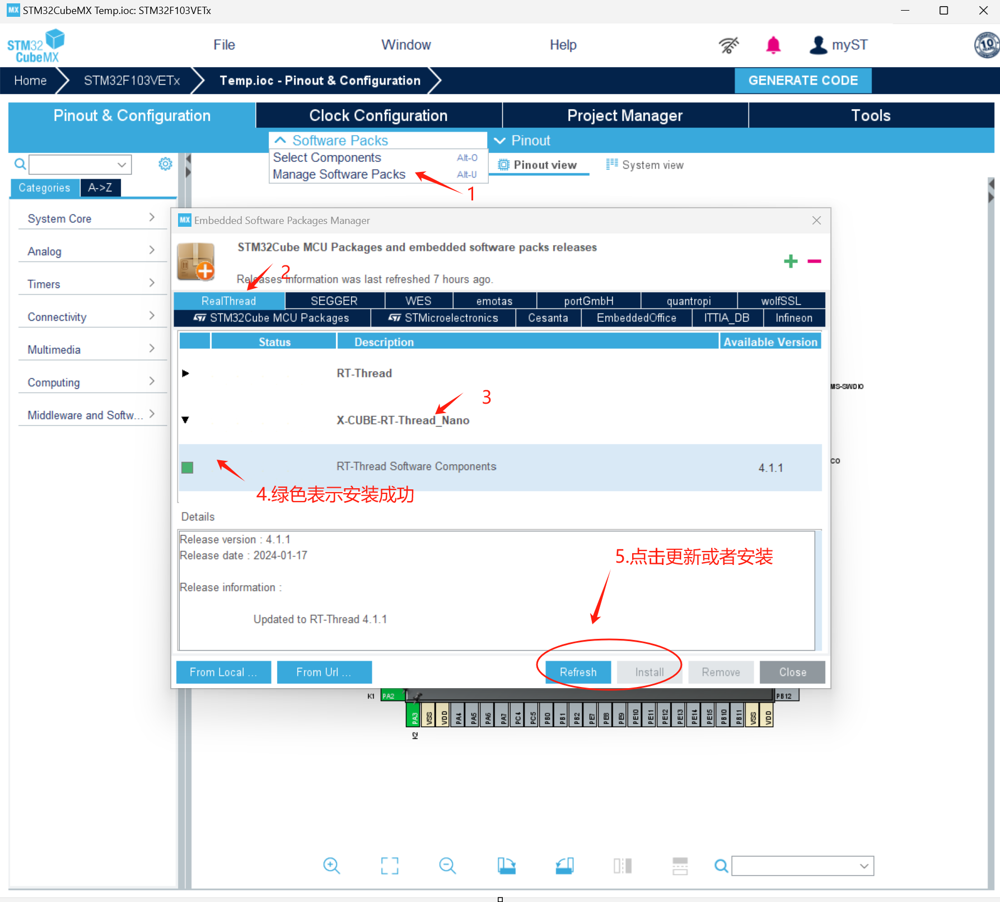
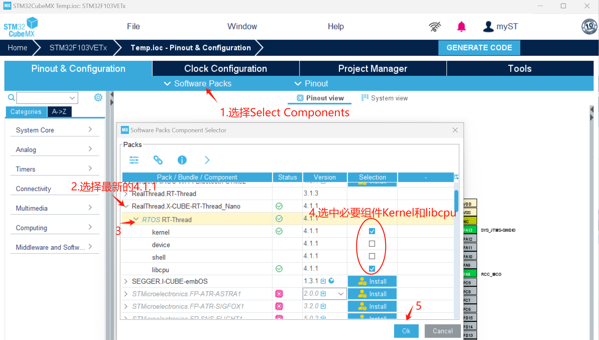
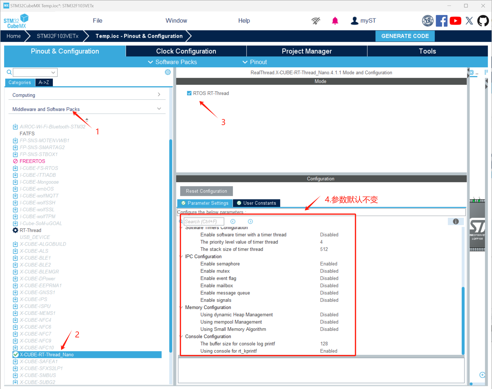
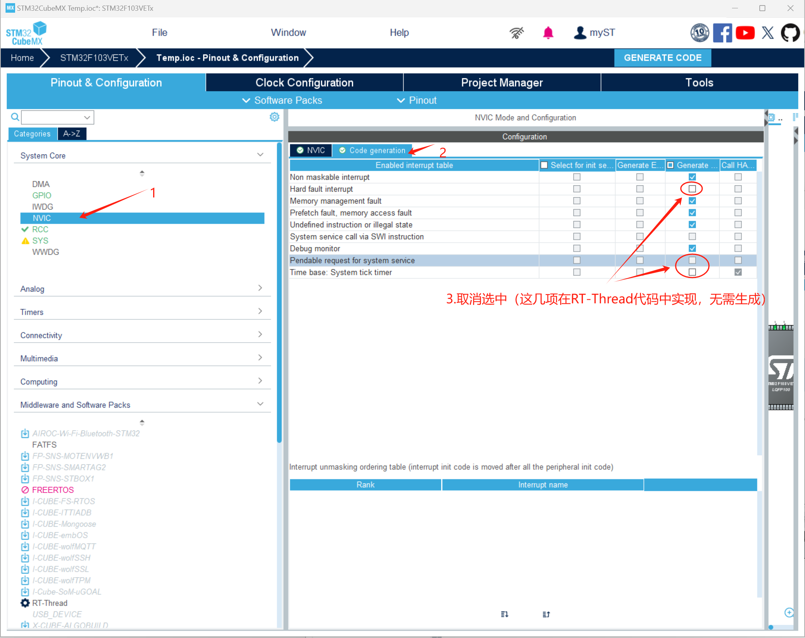
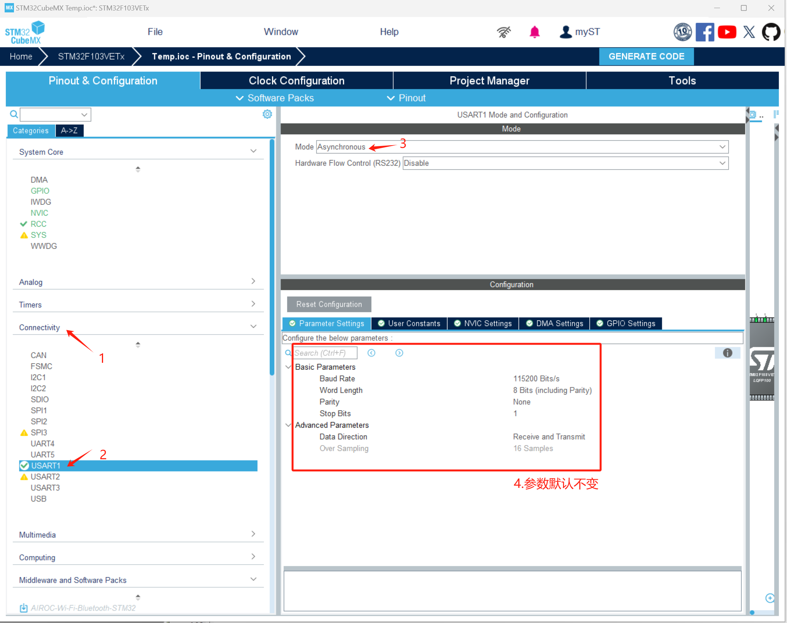
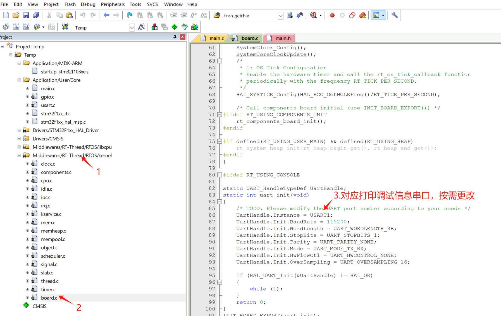
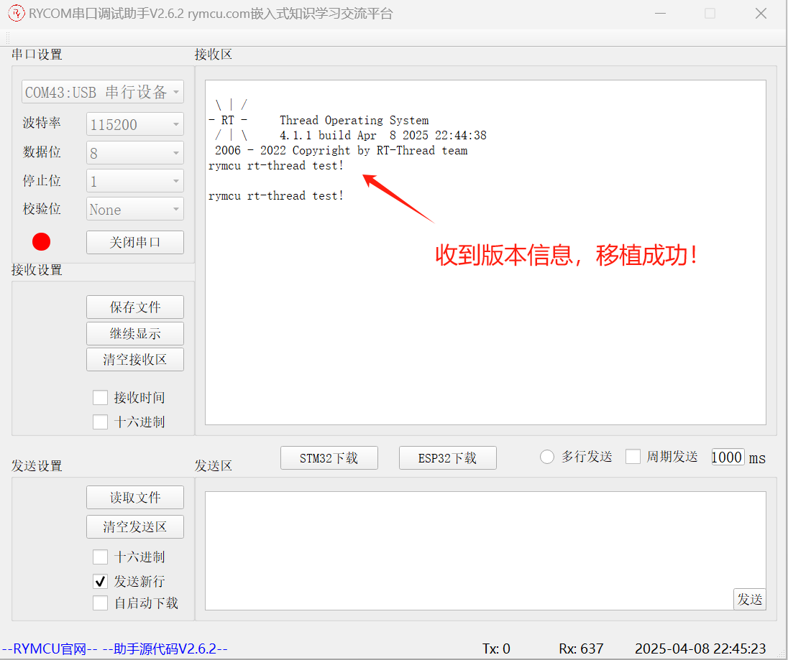

#  第二十二章 `RT-Thread`操作系统移植

## 1.前期准备

在第三章工程基础上实现以下功能：

移植`RT-Thread`操作系统成功。

## 2.创建项目

双击`Temp.ioc`，进入`STM32CubeMX`编辑页面

### 2.1.安装`RT-Thread Nano v4.1.1`软件包



### 2.2.配置`RT-Thread`软件包

配置软件包如下，选中必要组件`Kernel`和`libcpu`。



选中`RTOS RT-Rthread`,并保持参数默认不变。



在 RT-Thread 中重新定义了`HardFault_Handler`， `PendSV_Handler`， `SysTick_Handler`中断函数，无需`cubeMX`生成，取消选中如下。



### 2.3.添加串口支持

添加串口，用于打印调试信息，设置完成后生成代码。



## 3.编辑代码

### 3.1.编辑测试代码

如下图所示，按需调整输出打印信息的串口，前面设置了`USART1`，我们这里保持不变。



`main.c`中添加头文件，并在`while`循环增加打印信息。

```c
#include "rtthread.h"
  /* USER CODE BEGIN WHILE */
  while (1)
  {
    /* USER CODE END WHILE */
    /* USER CODE BEGIN 3 */
	rt_kprintf("rymcu rt-thread test!\r\n");
	rt_thread_delay(1000);
  }
  /* USER CODE END 3 */
```

### 3.2.适配`vscode + platformio`

本小节针对`vscode + platformio`开发环境，`Keil`直接跳过。

**步骤一：配置`platformio.ini`**

```ini
; PlatformIO Project Configuration File
;
;   Build options: build flags, source filter
;   Upload options: custom upload port, speed and extra flags
;   Library options: dependencies, extra library storages
;   Advanced options: extra scripting
;
; Please visit documentation for the other options and examples
; https://docs.platformio.org/page/projectconf.html

[env:rymcu_nebulapi_f103ve]
platform = ststm32
board = rymcu_nebulapi_f103ve

upload_protocol = cmsis-dap
build_unflags = 
build_flags =
 -DUSE_HAL_DRIVER
 -DSTM32F103xE

 -ICore/Inc 
 -IDrivers/STM32F1xx_HAL_Driver/Inc 
 -IDrivers/STM32F1xx_HAL_Driver/Inc/Legacy 
 -IDrivers/CMSIS/Device/ST/STM32F1xx/Include 
 -IDrivers/CMSIS/Include 
 -IRT-Thread 
 -IMiddlewares/Third_Party/RealThread_RTOS_RT-Thread/include


build_src_filter = +<Core/Src> +<Drivers/> +<Middlewares/> +<startup_stm32f103xe.s>
board_build.ldscript = ./STM32F103VETx_FLASH.ld
extra_scripts = post:copy_bin_to_root.py
[platformio]
src_dir = ./
```

**步骤二：修改启动文件`startup_stm32f103xe.s`**

因`vscode + platformio`采用`gcc`编译器，需将启动文件`startup_stm32f103xe.s`中 `bl main`改为`bl entry`。

**步骤三：修改`STM32F103VETx_FLASH.ld`文件**

`RT-Thread`在初始化阶段使用`INIT_BOARD_EXPORT()`方法添加相应的初始化函数，该方法的使用需要在`STM32F103VETx_FLASH.ld`文件的`.text`字段进行声明。但是`cubeMX`生成的`STM32F103VETx_FLASH.ld`缺少该部分内容，因此手动修改如下：

```ini
  /* The program code and other data goes into FLASH */
  .text :
  {
    . = ALIGN(4);
    *(.text)           /* .text sections (code) */
    *(.text*)          /* .text* sections (code) */
    *(.glue_7)         /* glue arm to thumb code */
    *(.glue_7t)        /* glue thumb to arm code */
    *(.eh_frame)

    KEEP (*(.init))
    KEEP (*(.fini))

    . = ALIGN(4);
    _etext = .;        /* define a global symbols at end of code */
    /* 添加INIT_BOARD_EXPORT支持-begin */
    . = ALIGN(4);
    __rt_init_start = .;
    KEEP(*(SORT(.rti_fn*)))
    __rt_init_end = .;
    /* 添加INIT_BOARD_EXPORT支持-end */
  } >FLASH
```

## **4.下载验证**

编译代码并下载，串口调试助手查看结果：



## 5.小结

本章实现了基于`cubeMX`的`stm32 HAL`库嵌入式操作系统`RT-Thread`移植。