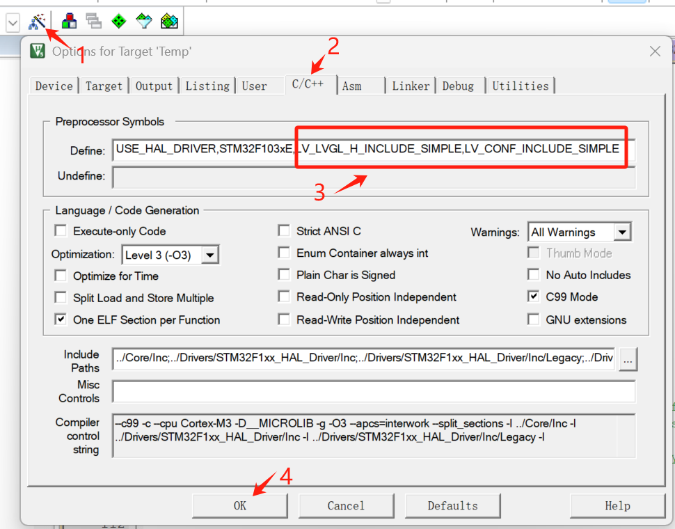

#  第二十三章 `LVGL`移植

## 1.前期准备

在第二十一章工程基础上实现以下功能：

移植`LVGL9.2.2`。

## 2.创建项目

双击`Temp.ioc`，进入`STM32CubeMX`编辑页面

**步骤一：创建`1ms`定时器(用于`LVGL`计时)**


**步骤二：调整堆栈大小**


## 3.编辑代码

### 3.1.`vscode + platformio`开发环境下

本小节针对`vscode + platformio`开发环境，`keil`请忽略并直接跳转下一小节。

#### **步骤一：配置`platformio.ini`**

在第二十一章配置文件`platformio.ini`基础之上，添加`LVGL9.2.2`库，并添加宏定义`LV_CONF_INCLUDE_SIMPLE`和`LV_LVGL_H_INCLUDE_SIMPLE`,详细配置如下：

```ini
; PlatformIO Project Configuration File
;
;   Build options: build flags, source filter
;   Upload options: custom upload port, speed and extra flags
;   Library options: dependencies, extra library storages
;   Advanced options: extra scripting
;
; Please visit documentation for the other options and examples
; https://docs.platformio.org/page/projectconf.html

[env:rymcu_nebulapi_f103ve]
platform = ststm32
board = rymcu_nebulapi_f103ve
framework = stm32cube

debug_tool = cmsis-dap
upload_protocol = cmsis-dap
extra_scripts = post:copy_bin_to_root.py

build_flags =
 -DLV_CONF_INCLUDE_SIMPLE
 -DLV_LVGL_H_INCLUDE_SIMPLE

lib_deps = lvgl/lvgl@^9.2.2
[platformio]
src_dir = Core/Src
include_dir = Core/Inc
```

**步骤二：找到`LVGL`配置文件`lv_conf.h`**

在步骤一的基础上编译项目，编译完成后项目将自动下载`LVGL`相关文件，并添加到了工程目录。找到`lv_conf_template.h`,将它复制到`Core/Inc`目录下并改名为`lv_conf.h`。


**步骤三：修改`LVGL`配置文件`lv_conf.h`**

**修改`14`处配置，如下所示：**

```c
#if 1 //0 1.RYMCU-hugh /*Set it to "1" to enable content*/
#define LV_COLOR_DEPTH 16 //#define LV_COLOR_16_SWAP 0 //2.RYMCU-hugh
#define LV_MEM_SIZE (24 * 1024U)  //64 3.RYMCU-hugh        /*[bytes]*/  
#define LV_DEF_REFR_PERIOD  10 //33 4.RYMCU-hugh      /*[ms]*/
#define LV_DPI_DEF 99 //130     /*[px/inch]*/ //= ((√320*240) / 2.8) ≈ 99 5.RYMCU-hugh
#define LV_USE_LOG 1 //0 6.RYMCU-hugh
#define LV_LOG_LEVEL LV_LOG_LEVEL_ERROR //LV_LOG_LEVEL_WARN 7.RYMCU-hugh
#define LV_ATTRIBUTE_MEM_ALIGN __attribute__((aligned(4)))  //8.RYMCU-hugh
#define LV_FONT_MONTSERRAT_12 1  //0 9.RYMCU-hugh
#define LV_FONT_MONTSERRAT_16 1  //0 10.RYMCU-hugh
#define LV_FONT_MONTSERRAT_22 1  //0 11.RYMCU-hugh
#define LV_FONT_MONTSERRAT_24 1  //0 12.RYMCU-hugh
#define LV_USE_SYSMON   1 //0 13.RYMCU-hugh
#define LV_USE_PERF_MONITOR 1 //0 14.RYMCU-hugh
```

**步骤四：添加显示驱动`lv_prort_disp.h`和`lv_prort_disp.c`**

分别将显示驱动`lv_prort_disp.h`和`lv_prort_disp.c`添加至`Core/Inc`和`Core/Src`目录下。

`lv_prort_disp.h`

```c
/*Copy this file as "lv_port_disp.h" and set this value to "1" to enable content*/
#if 1 //RYMCU

#ifndef LV_PORT_DISP_TEMPL_H
#define LV_PORT_DISP_TEMPL_H

#ifdef __cplusplus
extern "C" {
#endif

#if defined(LV_LVGL_H_INCLUDE_SIMPLE)
#include "lvgl.h"
#else
#include "lvgl/lvgl.h"
#endif
    
/* Initialize low level display driver */
void lv_port_disp_init(void);
void disp_enable_update(void);
void disp_disable_update(void);

#ifdef __cplusplus
} /*extern "C"*/
#endif
#endif /*LV_PORT_DISP_TEMPL_H*/
#endif /*Disable/Enable content*/
```

`lv_prort_disp.c`

```c
/*Copy this file as "lv_port_disp.c" and set this value to "1" to enable content*/
#if 1 //RYMCU

#include "lv_port_disp.h"
#include <stdbool.h>
#include "bsp_lcd_driver.h" //RYMCU

#ifndef MY_DISP_HOR_RES
 //RYMCU   #warning Please define or replace the macro MY_DISP_HOR_RES with the actual screen width, default value 320 is used for now.
    #define MY_DISP_HOR_RES    240
#endif

#ifndef MY_DISP_VER_RES
//RYMCU    #warning Please define or replace the macro MY_DISP_VER_RES with the actual screen height, default value 240 is used for now.
    #define MY_DISP_VER_RES    320
#endif

#define BYTE_PER_PIXEL (LV_COLOR_FORMAT_GET_SIZE(LV_COLOR_FORMAT_RGB565)) /*will be 2 for RGB565 */
static void disp_init(void);

static void disp_flush(lv_display_t * disp, const lv_area_t * area, uint8_t * px_map);

void lv_port_disp_init(void)
{
    /*-------------------------
     * Initialize your display
     * -----------------------*/
    disp_init();

    /*------------------------------------
     * Create a display and set a flush_cb
     * -----------------------------------*/
    lv_display_t * disp = lv_display_create(MY_DISP_HOR_RES, MY_DISP_VER_RES);
    lv_display_set_flush_cb(disp, disp_flush);

    /* Example 1
     * One buffer for partial rendering*/
    LV_ATTRIBUTE_MEM_ALIGN
    static uint8_t buf_1_1[MY_DISP_HOR_RES * 10 * BYTE_PER_PIXEL];            /*A buffer for 10 rows*/
    lv_display_set_buffers(disp, buf_1_1, NULL, sizeof(buf_1_1), LV_DISPLAY_RENDER_MODE_PARTIAL);

}

/*Initialize your display and the required peripherals.*/
static void disp_init(void)
{
    /*You code here*/
	LCD_Init();   //RYMCU   
}

volatile bool disp_flush_enabled = true;

/* Enable updating the screen (the flushing process) when disp_flush() is called by LVGL
 */
void disp_enable_update(void)
{
    disp_flush_enabled = true;
}

/* Disable updating the screen (the flushing process) when disp_flush() is called by LVGL
 */
void disp_disable_update(void)
{
    disp_flush_enabled = false;
}

static void disp_flush(lv_display_t * disp_drv, const lv_area_t * area, uint8_t * px_map)
{
	if(disp_flush_enabled) 
	{
		ry_lcd_fill(area->x1,area->y1,area->x2,area->y2,px_map);
	}
    lv_display_flush_ready(disp_drv);
}
#else /*Enable this file at the top*/
/*This dummy typedef exists purely to silence -Wpedantic.*/
typedef int keep_pedantic_happy;
#endif
```

### **3.2.`keil`开发环境下**

**步骤一：下载`keil`官方`LVGL Pack`**

到`arm Keil | lvgl`官网（`https://www.keil.arm.com/packs/lvgl-lvgl/versions/`）下载`lvgl 9.2.2`的`keil Pack`,下载完成后双击安装。


**步骤二：配置`LVGL Pack`**

打开`Keil Pack`管理界面，选中`9.2.2`版本。


配置`9.2.2`


**步骤三：配置`lv_conf.h`**

找到`lv_conf_cmsis.h`,将它复制到`Core/Inc`目录下并改名为`lv_conf.h`,**按照`3.1`小节的步骤三修改**。


**步骤四：添加显示驱动`lv_prort_disp.h`和`lv_prort_disp.c`**

**同`3.1`小节的步骤四**，注意`Keil`环境下还需要将`.c`再次添加到工程。

**步骤五：配置宏定义**

添加宏定义`LV_CONF_INCLUDE_SIMPLE`和`LV_LVGL_H_INCLUDE_SIMPLE`,详细配置如下：



到此，可以编译`Keil`工程，配置无误的话，编译通过，但会有很多警告，不影响。

### **3.3.修改`main.c`**

**步骤一：添加头文件支持**

```c
#include "lvgl.h"
#include "lv_port_disp.h"
```

**步骤二：添加初始化及测试代码**

```c
  /* USER CODE BEGIN 2 */
	HAL_TIM_Base_Start_IT(&htim2);
	lv_init();
	lv_port_disp_init();
	//lv_port_indev_init();
  //lv_log_register_print_cb(my_print);

    // 创建测试UI
  lv_obj_t* label2 = lv_label_create(lv_scr_act());
  lv_label_set_long_mode(label2,LV_LABEL_LONG_SCROLL_CIRCULAR);/*circular scroll*/
  lv_obj_set_width(label2,120);

  lv_label_set_text(label2,"Hello LVGL 9.2.2 www.rymcu.com keil");
  lv_obj_align(label2,LV_ALIGN_CENTER,0,0);
  lv_obj_invalidate(label2);
  /* USER CODE END 2 */
```

**步骤三：添加while循环代码**

```c
  /* Infinite loop */
  /* USER CODE BEGIN WHILE */
  while (1)
  {
    /* USER CODE END WHILE */

    /* USER CODE BEGIN 3 */
		lv_timer_handler();	
		HAL_Delay(5); 
    HAL_GPIO_TogglePin(LED1_GPIO_Port,LED1_Pin);
		lv_tick_inc(1);
	}
  /* USER CODE END 3 */
```

**步骤四：添加定时器中断处理**

```c
void HAL_TIM_PeriodElapsedCallback(TIM_HandleTypeDef *htim)
{	
	HAL_GPIO_TogglePin(LED2_GPIO_Port,LED2_Pin);
	static uint16_t i = 0;
	if (htim->Instance == htim2.Instance)
	{
		i++;
		if(i == 500)
		{
			i=0;
			HAL_GPIO_TogglePin(LED1_GPIO_Port,LED1_Pin);
			printf("tim2 update\r\n");
		}
		lv_tick_inc(1);
	}
}
```

## **4.下载验证**

编译代码并下载，查看结果：


## 5.小结

本章实现了`LVGL`移植。 