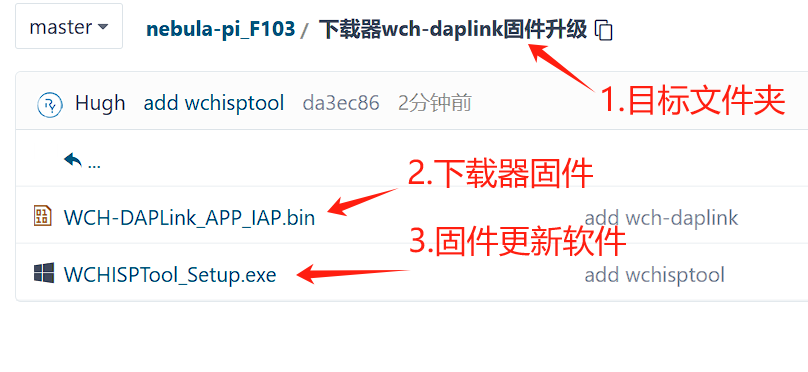

# 前言

## 1.概述

  

**星允派是一款双核单片机开发板，由嵌入式社区`RYMCU`倾力打造。板载`Cortex-M3(STM32F103VET6) `与 `RISC-V(CH32V203C8T6)`内核单片机。探索双核新境界，双重体验，释放无限创造力！**   **还在为选择`ARM Cortex-M`还是`RISC-V`而犹豫？星允派`Nebula Pi` 开发板，一块板卡，双重体验，释放无限创造力！**
  ✨ 核心亮点，不容错过： ✨

  - 🔥 双核驱动，性能加倍： 同时搭载广受欢迎的 `STM32F103VET6 (ARM Cortex-M3)` 和新兴的 `CH32V203C8T6 (RISC-V)`，无论是学习研究、性能比对还是双核协作项目，一块板卡全搞定！

  - 🔗 工业级通信，即插即用： 板载 `CAN` 和 `RS422` 通信接口，配备专用接线端子，无需额外购买收发器，轻松应对工业控制、汽车电子、多机通信等场景。

  - 💡 调试无忧，开发顺畅：  `RISC-V (CH32) `出厂下载了` CMSIS-DAP` 下载器固件，结合独立的` Type-C` 调试/下载接口，让您的开发调试流程如丝般顺滑。

  - 💾 海量存储，随心扩展： 板载 `EEPROM`、`SPI Flash` 还不够？更有 `Micro SD` 卡槽，满足您对数据记录、固件存储、文件系统等各种大容量存储需求。

  - 👀 视觉呈现，丰富多彩： 预留` 0.96" OLED `直插座，提供通用 `SPI` 屏接口，更能驱动` 2.8` 寸触摸彩屏。配合板载 `RGB` 彩灯和 `8 `位流水灯，状态显示直观生动。

  - 🛠 `IO `丰富，扩展无限： 大量 `GPIO` 引脚整齐排列，来自 `STM32` 和` CH32` 的双重扩展能力，无论是传感器、模块还是自定义电路，都能轻松接入。

  - 🛡 稳定可靠，安全保护： 方便的 `5V` 端子输入，板载稳压电路，更有自恢复保险丝保驾护航，让您的创意实践无后顾之忧。

  - 🖱 人机交互，触手可及： 板载多个按键（复位、启动、用户自定义），配合 `LED` 指示，调试交互简单直接。

      

##     2.资源配置

| 序号 | 资源                  | 功能                                                         |
| :--: | :-------------------- | ------------------------------------------------------------ |
|  1   | 副`CPU:CH32V203CT6`   | `RISC-V`内核单片机，出厂下载好`CMSIS-DAP`固件作为`STM32`单片机下载器使用。最高主频:`144MHz,64K FLASH,20K RAM` |
|  2   | `CH32`引出`IO`口      | 引出副`CPU`的`IO`口，作为`RISC-V`单片机开发板使用。          |
|  3   | `0.96 OLED`插座       | 预留`0.96 OLED`插座和`SPI`液晶屏幕接口                       |
|  4   | `RGB`彩灯`WS2812`     | 掌握`WS2812 RGB`彩灯工作原理及驱动方法                       |
|  5   | `8`位`LED`流水灯      | 点亮第一个`LED`小灯，嵌入式领域的`Hello world`               |
|  6   | `STM32`引出`IO`口     | 引出`IO`口方便测试使用                                       |
|  7   | `CAN`通信接口         | 板载`CAN`通信接口芯片`SN65HVD230DR`，`3.3V`供电，最高速率：`1Mps`，`KF301-2P`端子引出，方便连接外部`CAN`设备 |
|  8   | `RS422`通信接口       | 板载`RS422`接口芯片`MAX3490`，速率`10Mbps`，`KF301-4P`端子引出 |
|  9   | `EEPROM`存储器        | `I2C`通信存储器，芯片`AT24C02`，容量：`256`字节，掉电不丢失数据 |
|  10  | `SPI FLASH`存储器     | 芯片型号：`W25Q64`，容量：`8M`字节，掌握`SPI`通信协议        |
|  11  | `5`V供电端子          | 除了`USB`供电外，还可以通过`KF301-2P`端子进行供电，并有防止反接的二极管 |
|  12  | `2.8`寸触摸显示接口   | 预留`2.8`寸触摸液晶显示器接口，采用并口通信，适配社区触摸显示屏模块，掌握触摸屏的使用 |
|  13  | 主`CPU:STM32F103VET6` | `Cortex-M3`内核单片机,主频`72MHz`,`512K FLASH`,`64K RAM`     |
|  14  | `8MHz`晶振            | 晶振，为单片机提供心跳                                       |
|  15  | `SD`卡槽              | `MicroSD`卡(`TF`卡) 卡座，`SPI`接口，支持最大卡容量`32GB`    |
|  16  | `STM32`按键           | `3`个按键，分别连接至主`MCU`复位及`IO`口                     |
|  17  | 串口及`SWD`接口       | 预留排针，使用跳线帽连接，灵活使用。方便板载`STM32`下载器给其他单片机下载程序，反过来也可以 |
|  18  | 电压`5V`转`3.3V`      | `500mA`,芯片`TPRT9013`                                       |
|  19  | `CMSIS-DAP`模式选择   | 板载`CMSIS-DAP`有`HID`和`WINUSB`模式，通过按键进行选择。建议`macOS`选择`HID`模式，无需单独安装驱动 |
|  20  | `USB1(type-C)`        | `STM32`下载口，连接此`USB`实现代码下载调试和`USB`转串口通信。同时还是`RISC-V`单片机`USB`设备口，也是`CMSIS-DAP`固件更新口 |
|  21  | 自恢复保险丝          | 板载`750mA`自恢复保险丝，无惧短路风险，适合新手              |
|  22  | `CH32`按键            | `RISC-V`单片机复位和启动选择按钮                             |
|  23  | `USB2`(type-c)        | `STM32` `USB`设备口                                          |

## 3.使用说明

### **步骤一：`type-c USB`线、`0.96 OLED`和`2.8`寸触摸显示屏**

### **步骤二：连接`USB`线至计算机**

打开社区串口调试助手`RYCOM`和`Keil`,分别能识别出`USB`转串口端口号、`STM32`下载器`CMSIS-DAP`和`F103`单片机。

### **步骤三：三种代码下载方式**

下载前先找到工程文件和`.hex`格式可执行文件，其中.hex用于串口下载方式。

#### **方式一：串口下载**

找到出厂综合例程`nebula-pi.hex`，配置跳线帽设置为串口下载模式。

设置好后，按一下开发板左下角`RST`复位按键，复位单片机。打开社区串口调试助手`RYCOM`，按步骤操作下载。

**`mac`用户可安装串口调试助手`RYCOM 2.6.2.dmg`，首次使用可能需要先打开串口使用权限。**

#### **方式二：`Keil`软件下载**

前提条件为已经正确安装`Keil MDK`软件，找到仓库下`Keil`工程，操作如下。

找到工程的`MDK-ARM`文件夹，双击`Temp.uvprojx`打开工程。

**第一次使用时需要设置步骤`2-9`,后续只需点击步骤`1`，`10`即可完成下载。目前`Keil`暂时不支持`macOS`。**

#### **方式三：`vscode`下载**

该方法同时支持`macOS`和`win`。使用`vscode + Platformio`方式，首次使用需要：安装`vscode`软件及`platformio`插件等相关内容，`vscode`请网络搜索并安装，完成后打开`vscode`，安装`platformio`插件如下。

点击`vscode`的`File->Open Folder...`，打开社区星云派仓库`PIO_HAL`文件夹下的任意一个工程文件夹即可。

## 4.板载下载器`cmsis-dap`固件更新方法

星允派资源包中找到文件夹“下载器 `wch-daplink` 固件升级”，内部包括固件更新软件和下载器固件，如下所示：

第一次使用请先安装固件更新软件 `WCHISPTool_Setup.exe`，安装完成运行如下：

解除保护方法如下：

